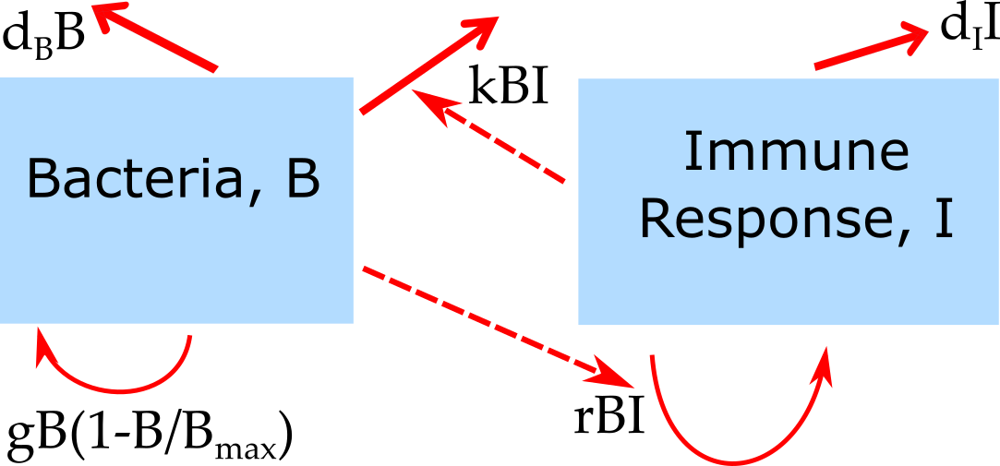

```{r, echo = FALSE}
library(emo)
```


# Overview
This document provides an introduction to a few basic models that describe within-host infection dynamics.

# Learning Objectives
* Be familiar with a few basic within-host models.

# Slides
We will discuss this topic in one of the zoom sessions. The slides for that session [can be found here.](./slides/Simple_Models_Slides.html)


# Reading

_This material overlaps with the slides._


## A very simple compartmental model

Consider a single population of entities (pathogens/immune cells/humans/animals) that grow or die. We want to model this population. We'll implement the model as a discrete time equation, given by:

$$
P_{t+dt} = P_t + dt ( g P_t - d_P P_t )
$$

$P_t$ are the number of pathogens in the population at current time $t$, $dt$ is some time step and $P_{t+dt}$ is the number of pathogens in the future after that time step has been taken. The processes/mechanisms modeled are growth at rate $g$ and death at rate $d_P$.

Try to "simulate" the model for yourself, either in our head or with pencil or paper. Assume we start with $B_0=100$ bacteria at t=0, go in steps of hours ($dt=1h$) and birth rate is $g=4$ per hour and death is $d_P=2$ per hour. How many bacteria are there after 1,2,3... hours?


## From words to models

When you start building a new model, it is important to carefully go back and forth between your verbal description of the system you want to model and your actual model. You will soon realize that the mapping from words to specific models/equations requires some thought (we'll visit this topic in detail later). For instance here are two models that also have the processes of pathogen growth and birth, but the specific way those processes are implemented differs from the above model.

Variant 1:
$$
P_{t+dt} = P_t + dt ( g - d_P P_t )
$$

Variant 2:
$$
P_{t+dt} = P_t + dt ( g P_t - d_P)
$$
In variant 1, the term describing growth/increase of pathogens is changed from one that is proportional to pathogen load ($gP_t$) to one that occurs at a fixed rate ($g$). Those represent two different biological mechanisms. The original one mimics exponential growth one would see from e.g. a population of dividing bacteria. The more bacteria there are, the more new ones are produced, and that happens at some given rate. The second model describes the process of a constant production of new entities. This might for instance be a good choice if $P$ were a population of immune cells which are - in the absence of an infection - produced by the body at some constant rate, independent of the number of cells that are present. Thus, both the original model and variant 1 are biologically reasonable models and one should choose the formulation that better mimics the system one wants to study.

Things are a bit different for model variant 2. Here the death/removal term is changed. In the original model, $P$ is removed at some per-capita rate $d_P$ so the total removal is $d_PP_t$. In variant 2, the removal occurs at a fixed rate $d_P$ and is independent of $P_t$. This model variant is in fact a bad model and can never represent any real biological system. Think about it for a moment why that is so. Got it? The problem is that in this model, if there are no $P$ around, i.e. $P_t=0$ at some point, removal still occurs at rate $d_P$. Obviously, if no $P$ is left, none of them can leave/die. Thus, there is no biological scenario for which this model makes sense, it's simply a wrong model. This is a general feature you should keep in mind - and a mistake I see novices make often. Any outflow, i.e. a term with a minus-sign on the right side of the equation, needs to be multiplied by the compartment that it is tracking (e.g. here $P$), otherwise you will have the potential problem of removing things from an empty compartment.


## Model diagrams

When you start out building models, reading and writing equations might not come easy initially. It is therefore a good idea to also use diagrams. In fact, diagrams are always a great tool, no matter how advanced you are in our modeling career. In a diagram for the types of models we discuss here, each component that is tracked is represented by a box, the different processes are represented by arrows. For the very simple model above, the diagram looks like this:

```{r onecompldiagram,  fig.cap='', echo=FALSE, out.width = '80%'}
knitr::include_graphics("./media/nri_review_onecompmodel.png")
```


## Exploring the simple model

Above, I suggested you explore what the model will produce for some choices of $g$ and $d_P$. More generally, can you figure out what kind of results you can get from this model for different values of the growth and death parameters, $g$ and $d_P$? You can try thinking through it (which is possible for simple models like this one, but usually doesn't work for complex models). You could also try different combinations by hand, but that gets tedious. Finally, you can explore the model on a computer. In this case, the model is very simple and the following lines of `R` code can let you run it.

```{r simplemodelcode}
#specify values for the model parameters and the starting numbers for P
g = 10
dP = 5
P0 = 1
#specify time for which we want to run the model and time steps
dt=0.1
tmax=20
time = seq(0,tmax,by=dt)
# create a vector of the right length and fill it with 0s
# this vector will contain P at every time step 
Pvec = rep(0,length(time))
Pvec[1] = P0 #enter the starting value
#run the model by stepping forward in time
for (i in 1:(length(time)-1)) {Pvec[i+1]=Pvec[i]+dt*(g*Pvec[i]-dP*Pvec[i])}
plot(time,Pvec,log="y")
```

I added comments to the code so it's hopefully clear what is happening. That is always a good idea! In my opinion, at least 50% of code should be comments. Your collaborators and your future self will thank you. It might seem excessive when you start with simple code, but it soon gets complex and without comments you will have no idea what you did if you look at your own code a few weeks later, let alone someone else's.

Try different values for $g$ and $d_P$ and look at the different patterns you can get. You should find that only 3 patterns are possible. If $g<d_P$, $P$ will go to zero from its starting value. That's a reasonable biological behavior. If $g=d_P$, $P$ will stay at its starting value. That's somewhat reasonable, however in the real world, things are never exactly equal, so this model behaviour is not very robust. If $g>d_P$ you will see that $P$ grows exponentially forever. While exponential growth is reasonable and often seen, it does not go on forever. Eventually, something slows down the growth. Usually, it is some resource limitation (no more food, no more space, etc.). To make the model more realistic, let's implement such saturating growth.


## Adding saturating growth

As always, we start with a verbal description of the process we want to model, and then try to express that in some mathematical form. Here what we want to model is "growth of $P$ that is initially exponential, but once $P$ approaches some value, growth should be reduced and eventually go to zero." Give it a try and see if you can modify the growth term in the model from $gP_t$ to something else such that it captures this process.

There is generally more than one way to translate a certain process into equations. Here is one way it can be done, a very common form. You might have come up with something different. Just make sure it does properly capture the biological process.

$$
P_{t+dt} = P_t + dt ( g P_t(1-\frac{P_t}{P_{max}}) - d_P P_t )
$$

By adding the extra term $(1-\frac{P_t}{P_{max}})$, we get a behavior that if $P_t$ is much smaller than $P_{max}$, this term is close to 1, so we get exponential growth. As $P_t$ approaches $P_{max}$, the term approaches 0 and thus growth slows down. If you want to explore this model, you can modify the `R` code above and play with it. You need to introduce the new parameter $P_{max}$ and give it some value, and you need to update the `for` loop with the new growth term. Everything else can stay the same. You should now find that the exponential growth has been replaced by growth that is initially exponential and then settles down at some level just below $P_{max}$. The exact level at which you have no more growth (or death) is given if the growth and death terms balance each other, i.e. $g P_t(1-\frac{P_t}{P_{max}}) = d_P P_t$. You can solve this equation for $P$ to figure out the exact value that $P$ reaches and it which it stays. This is called the steady state value, for obvious reasons.


## Continuous time models
So far, we have looked at a model where the state of the system (the variable $P$ in our example) is updated in discrete time steps. Those steps ($dt$ in our model) are chosen by the modeler. While discrete-time models tend to be easier to grasp initially, they are not used too much for compartmental models like this one, i.e. models that track total populations. The reason for this is that in a large population, you have constantly something going on (someone being born or dying in our example), so it's often better to describe the system as a continuous model. We'll come back to this topic of discrete time versus continuous time models. For now, just note that most models like this one are formulated as continuous time model, more specifically as ordinary differential equations (ODE). For a very small time-step, a discrete-time model approaches a continuous-time model. Here are the mathematical manipulations to get from one to the other.


Start with the discrete model

$$
P_{t+dt} = P_t + dt ( g P_t - d_P P_t )
$$

Then subtract $P_t$ on both sides and divide by $dt$ to get

$$
\frac{P_{t+dt} - P_t}{dt} =  g P_t - d_P P_t 
$$

Now the idea is to make the time step $dt$ very (infinitesimally) small, which leads to the continuous, ODE model formulation

$$
\frac{dP}{dt}  = gP - d_P P
$$
Alternative notations are

$$
\frac{dP(t)}{dt}  = gP(t) - d_P P(t)
$$
or the shorthand "dot notation" 

$$
\dot P  = gP - d_P P
$$
The last one is the most common and the one we'll use.

Note that when you implement a continuous time model on the computer, the computer has to take finite steps. There are numerical methods that choose small time-steps in a smart way such that the continous model behavior is approximated while still being numerically efficient. We'll be using the `deSolve` package in R which does that for us. Most of the time, you don't have to worry about the numerical routine (though occasionally things might go wrong, a first try if something with your model is strange is to see if changing the tolerances for the ODE numerical solver might help).


## Adding the immune response 
The model above is the simplest possible model, tracking only a single population. Things get more interesting once there are multiple, interacting components. We can extend our model by including an equation for the immune response. We'll also rename the $P$ variable now to $B$ to indicate specifically that we are modeling bacteria. This does not change any of the model behavior. A very simple model for the dynamics of bacteria and the immune response can be formulated as the following 2 differential equation model:

$$
\begin{aligned}
\textrm{Bacteria} \qquad \dot{B} & = gB(1-\frac{B}{B_{max}}) - d_B B - kBI \\
\textrm{Immune Response} \qquad \dot{I} & =  rBI - d_I I     
\end{aligned}
$$
The diagram for this model is this:

```{r bacteriadiagram,  fig.cap='Schematic for the simple bacteria model. Solid lines indicate in- and out-flows, dashed lines indicate interactions.', echo=FALSE, fig.align='center'}

```


In this model, some initial population of bacteria grow at rate $g$, which saturates as they approach some carrying capacity $B_{max}$. The bacteria also die at some fixed rate $d_B$. That part of the model is the same as for the one-compartment model above.

In this model, bacteria can also be cleared by the immune response at rate $k$. The immune response is modeled in a very abstract way with a single equation. As such it doesn't represent any specific biological component, but can instead be considered as the "total strength of the response". The immune response is induced and has a per-capita growth proportional to the presence of bacteria at rate $r$, and a death/decay rate of $d_I$. Note that as for the virus model, many alternative formulations are possible and the most appropriate one will depend on the specific system and question one wants to study. The model above is a minimal model useful as a conceptual starting point. The model is a type of predator-prey model, which have been heavily studied in ecology. Here, the bacteria are the prey and the immune response is the predator.


Simulating the dynamics of this model for some parameter choices leads to dynamics as shown in the Figure.

```{r bacteriamodel,  fig.cap='Dynamics of the simple bacteria model. Note that the oscillations seen in both bacteria load and immune response are rarely observed in actual infections, suggesting that this simple model might not be fully suitable to describe any real infection process.', echo=FALSE, fig.align='center'}
knitr::include_graphics("./media/bacteriamodel.png")
```

Despite the simplicity of this model, one can obtain rather interesting outcomes. You can explore this model further with DSAIRM.


## Simple viral infection model
A simple model that can capture the basic pattern of a viral infection is one that does not include the immune response. The model only considers uninfected and infected cells, as well as free virus. 
Uninfected cells, $U$, are created at some rate $n$ and die at some rate $d_U$. This process happens even in the absence of an infection. If virus is present, uninfected cells can become infected by free virus, $V$, at rate $b$. Infected cells, $I$,  produce virus at rate $p$ and die at rate $d_I$. 

Free virus infects cells at rate $b^$, and is cleared due by the immune response and other mechanisms (e.g. mechanical transport) at rate $d_V$. The parameter $g$ is there to account for different experimental units (PFU or similar vs number of cells) and make sure all units are consistent (it is always good to check that each term in your model, both on the left and right side, has the same units). For an acute infection, one usually ignores growth and death of uninfected target cells [@beauchemin11; @smith11]. The diagram, equations, and two simulations of the model, one without and one with natural birth and death of unifected cells, is shown in this figure:


```{r virusdiagram,  fig.cap='', echo=FALSE, fig.align='center'}
knitr::include_graphics("./media/nri_review_fig3.png")
```


## Modeling the immune response
The simple bacteria infection model above included a single equation for the immune response, the virus dynamics model did not include the immune response at all. Obviously, in most infections, the immune response plays an important role and thus will need to be considered. The immune response is very complex, with many different entities (cells, cytokines, etc.) interacting in complicated ways. As such, being able to model the immune response in full detail is not possible. The modeler will have to decide which components are important for a given scenario and question and include those, while still trying to keep the model at a manageable level of complexity (see further comments on that point below). Even including only a few immune response components quickly leads to fairy complex models. We illustrate this by including a few immune response components into the acute virus infection model. Specifically, we will add one equation to model the innate immune response, two equations for B-cells and antibodies, and one equation for CD8 T-cells.

The model works as follows. Uninfected cells, $U$, become infected by free virus, $V$, at rate $b$. Infected cells, $I$,  produce virus at rate $p$ and die at rate $d_I$. Free virus infects cells at rate $b^{'}$, is cleared by antibodies at rate $k^{'}_{A}$ or removed due to other mechanisms (e.g. mechanical transport) at rate $d_V$. Note that $b^{'}$ and $k^{'}_{A}$ differ from parameters $b$ and $k_{A}$ to account for experimental units (PFU for virus and titer for antibody). 
A (generic/abstract) innate response, $F$, is assumed to be produced and decays at rates $p_F$ and $d_F$ in the absence of an infection. Presence of virus leads to an increase in the innate response, with growth saturating at a maximum rate $g_F$. The maximum level the innate response can reach is given by the parameter $F_{\textrm{max}}$. The action of the innate response is twofold. First, it can directly counteract the virus by, for instance, reducing virus production rate of infected cells. In our model, the strength of production suppression is determined by the parameter $s_F$. The second action of the innate response is to induce the adaptive response. 
The dynamics of activated B cells is modeled as increasing in a sigmoidal manner dependent on both the amount of virus (antigen) and innate response present, with a maximum at rate $g_B$. Again, since we are focusing on the short-term dynamics of the system, B-cell decay is ignored. In the absence of an infection, B-cells are set to an arbitrary level of 1. B-cells produce antibodies at rate $r_A$. Antibodies decay naturally at rate $d_A$ and bind to and remove free virus at rate $k_A$. 
Finally, T-cells are induced proportional to virus/antigen at rate $a$ and then grow exponentially at rate $g_T$. Those T-cells kill infected cells at rate $k_T$.


$$
\begin{aligned}
\textrm{Uninfected cells} \qquad \dot{U} & = - bUV \\
\textrm{Infected cells} \qquad \dot{I} & =  bUV - d_I I -k_T T I\\     
\textrm{Virus} \qquad  \dot{V} & =  \frac{p}{1+s_F F}I - d_V V - k^{'}_{A}AV -  b^{'} UV\\ 
\textrm{Innate response} \qquad \dot{F} & = p_F - d_F F +  \frac{V}{V+h_V} g_F (F_{max} - F)  \\
\textrm{B cells} \qquad \dot{B} & =  \frac{F V}{FV+h_F} g_B B  \\
\textrm{Antibodies} \qquad \dot{A} & =   r_A B  - d_A A  - k_{A}AV \\
\textrm{T-cells} \qquad  \dot{T} & = aV + g_T T
\end{aligned}
$$


Simulating the dynamics of this model for some parameter choices leads to dynamics as shown in Figure \@ref(fig:immunemodel).

```{r immunemodel,  fig.cap='Dynamics of the model with innate and adaptive immunity for one choice of parameters.', echo=FALSE}
knitr::include_graphics("./media/immunemodel.png")
```

Note that different parameter choices lead to different dynamics. Parameters should be chosen based on what is known about the system. Bigger models tend to have more parameters, each of which needs to be specified. For systems that are not too well studied, obtaining reliable parameter estimates can be a challenge.

While the model is still fairly abstract, it is arguably more realistic comapred to the virus infection model without the immune response. The downside is that this model is more complex. The trade-offs of model simplicity versus complexity are further discussed below. Also note that there are many different ways one could map the detailed dynamics of the immune response into a set of equations. The above example is one way of doing it, but by no means the only one. It is up to the modeler, based on their understanding of the biology of the system, to decide how to implement the model. An interesting discussion and evaluation of different models that were used to simulate influenza infections can be found in [@dobrovolny2013c].


# Practice

You can further explore these models using DSAIRM.


# Further materials
* Our recent review [Simulation Modelling for Immunologists](https://handelgroup.uga.edu/publication/2020-handel-natrevimm/) discusses those simple models. 

* The paper [Modelling Viral and Immune System Dynamics](https://www.nature.com/articles/nri700) by Alan Perelson is another nice introduction focusing on virus models and explaining a few different models.  
* The paper [The role of models in understanding CD8+ T-cell memory](https://www.nature.com/articles/nri1550) by Antia et al. introduces a few simple models for T-cell dynamics.

