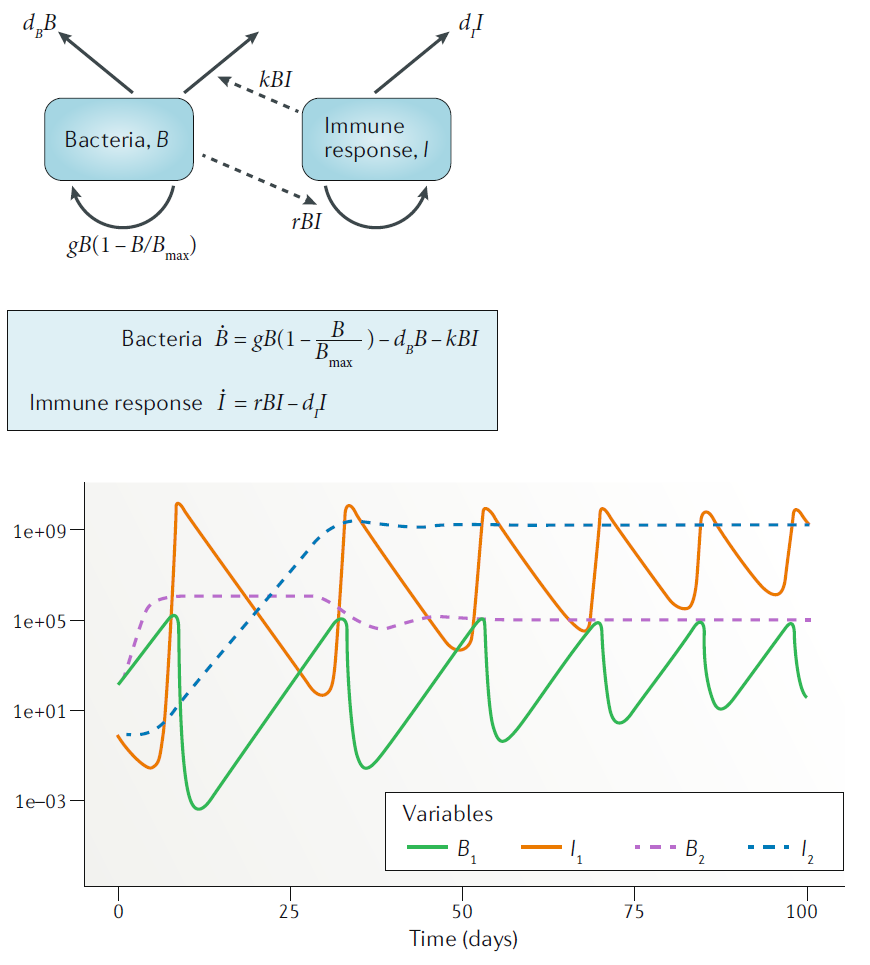
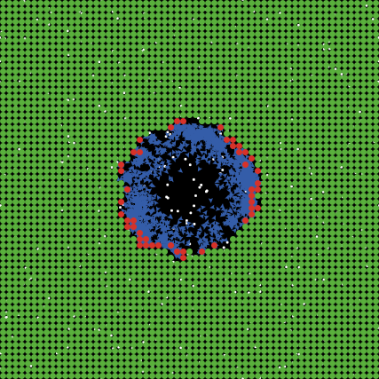

```{r, echo = FALSE}
library(emo)
```


# Overview
This document provides a brief overview of different types of simulation models, going beyond the ones that we focus on in this course.

# Learning Objectives
* Be familiar with different types of simulation models.


# Introduction
As you learned previously, computational/mathematical models come in many different variations. We already discussed the major classification into phenomenological (statistical) and mechanistic simulation models. Within the category of simulation models, there are again different types. The simple models we have explored so far, and that we will keep focusing on in this course, are all compartmental. Some are deterministic, some stochastic. The following sections provide a brief description of different model types and formulation to place things into context.


# Types of simulation models
There are many ways mechanistic simulation models can be formulated and implemented. Here are some ways of characterizing them:

* _Compartmental_ or _Agent-based_
* _Discrete time_ or _Continuous time_
* _Deterministic_ or _Stochastic_
* _Non-spatial_ or _Spatial_
* _Memory-less (Markov)_ or _With memory_
* _Small_ or _Big_
* _Data-free_ or _With data_

The most common model type is one using ordinary differential equations (ODEs). Such models are usually compartmental, continuous time, deterministic, space-less, memory-less, and small(ish). 

We'll briefly go through each of those categories to briefly illustrate the kinds of models that belong to one or the other. This is meant only as a quick survey, so you are familiar with other models. No details will be provided.


# Compartmental versus Agent/Individual based models

__Compartmental models__ are models in which the units we want to track (variables, e.g. bacteria and immune response) are treated as homogeneous groups (compartments), and one only tracks population numbers/sizes. This is the simplest type of model. Sometimes one can perform analytic computations, it is often easy to implement and run on a computer. Also, most available data comes in the form of total numbers (e.g. virus load, levels of a specific cytokine), thus compartmental models are natural choices for fitting to data. Because of their simplicity, compartmental models are often the best starting point. However, the assumption that each unit (e.g. each cell) is the same (homogeneous) and interacts with other entities of the system in a _well-mixed_ manner (like gas molecules bumping into each other randomly in a container) is clearly wrong. It is often a reasonable approximation, and thus compartmental models are still the most widely used. However, for certain questions or systems, this approximation might not be appropriate and thus other model types are needed.


```{r virusdiagram,  out.width = '70%', echo=FALSE, fig.align='center', fig.cap = "Example of a compartmental model."}

```


__Agent/Individual based models (ABM/IBM)__ track every unit/agent/individual instead of just total numbers. Thus, instead of just keeping track of total virus load, every virion is individually modeled and its actions tracked. Such models allow (almost) no mathematical analysis and tend to be harder to implement and run on a computer. Often, IBM tend to include a lot of details of the system under study. This means the model has many parameters and is "data hungry", i.e. one needs to know values for those parameters to be able to run the model. Due to the fact that each individual unit needs to be tracked, such models take long to run on a computer. Further, most data does not come in the form of individual level data, thus fitting such models to data is more difficult. A good feature of IBM is that while they tend to be difficult to build and run, they are often conceptually easy to understand. One simply specifies all processes that one wants to include and implements them in the form of computer code. Because IBM are more detailed, they can potentially the most realistic models. For systems where we have a lot of information and we want detailed predictions, IBM might be good options. 

In general, it is useful to start with a simple model if the system/question is new, even if the eventual goal is to move to an IBM. While one can write IBM in `R`, it is not that well suited due to speed limitations. Dedicated software exists for IBM, or modelers often use general purpose languages such as C.

```{r ibmexample21,  fig.cap='Example of a simple IBM model showing uninfected cells (green), infected cells (red) and virus (blue).',  echo=FALSE, out.width = "70%", fig.align='center'}

```


# Discrete time versus continuous time models


__Discrete time models__ are models where the variables are updated in discrete time-steps. Such models are good for systems where there is a “natural??? time step. For instance in malaria infections, the parasite enters a red blood cell (RBC) and replicates before bursting within a fairly determined time-window. One could model such a system by setting the model time-step to the duration of the replication phase inside the RBC. However, if one tracks the total population, most processes are better approximated by a continuous process. For instance in the malaria example, while each parasite spends a discrete, and similar amount of time inside a RBC, soon after the infection the entering and exiting of RBC is out of sync and thus on a population level, these processes occur continuously. Thus, for biological reasons, a discrete time model is rarely needed (but often an acceptable approximation). A reason why discrete time models are often used is the fact that for complex models, such as ABM/IBM, one has to update the system at discrete times for computational reasons. Note that as previously discussed, if the time-step becomes small, a discrete-time model approaches a continuous-time model. The exact meaning of "small" depends on the system and can be numerically explored.


__Continuous time models__ are models that assume that each process occurs continuously. This is generally the most parsimonous approximation for compartmental models that track a large number of individual units. Each unit (e.g. each cell or virus) undergoes certain processes (birth, death, infection, etc.) at discrete time steps, but for the population as a whole, these processes occur in an ongoing, continuous manner. Continuous-time models are usually described by differential equations. Ordinary differential equation (ODE) models are the most common and simplest one. Stochastic compartmental models can also be continuous-time, as described more below. The ODE models you were introduced to in the previous section are all continuous time models.


# Deterministic versus stochastic models


__Deterministic models__ always produce the same outcomes once parameters and initial conditions have been specified, no matter how often you run the model (or what software you use to do so). Such models are simple and easy to implement. All ODE models fall into this category. They run quickly on a computer, are fairly easy to analyze, and one can sometimes perform analytic calculations without the need for simulations, at least for simple models. The drawback is that real biological systems are never deterministic, though sometimes approximately so. In general, when large numbers of entities (cells, virus, etc.) are involved, the deterministic approximation tends to be reasonable. If numbers are low (e.g. at the start or end of an infection), stochastic processes might be important. All ODE models, including the models you have encountered so far, are deterministic.


__Stochastic models__ have inherent noise/randomness/stochasticity built in. This means that even for the same parameter values and starting conditions, you might get different results. For instance in one simulation, you might get an infection, in another the infection might not take off. That is due to randomness, which is implemented in computer models by using random numbers to decide how the model should react. Stochastic models are closer to the real world, and stochastic effects are especially important if numbers are low. For instance if you have 100 bacteria, it doesn't matter if one of them first divides, then dies, or the other way around. However, if you have a single cell, the order in which things happen matters, since if the cell dies, there is no possibility for later division.

In general, any scientific question of the form "what is the probability for X" requires some amount of stochasticity. Deterministic models only produce a single result, so they can't help answer any probabilistic questions.

The drawback of stochastic models is that they take longer to run on a computer, since one now needs to run a model more than once to get a distribution of outcomes, instead of just a single time for deterministic models. That also makes model results a little bit harder to analyze. Another drawback of stochastic models is that they are more difficult to fit to data. Modern software packages (e.g. the `pomp` package in `R`) make things somewhat easier, but it is still technically and computationally more challenging to fit stochastic models to data.

Note that sometimes, you might want to start with a deterministic model, just to quickly have one up and running, and then also build a stochastic one. It is important to keep in mind that for the same model with the same model settings, the average (mean or median) of the stochastic model results does not necessarily need to agree with the deterministic model. This is only true for linear models, and the simulation models we usually use are nonlinear.

Most IBM/ABM are stochastic models. This is not a requirement, but since ABM/IBM generally try to be as realistic as possible, and rarely used for fitting data, it makes sense to include the additional realism that comes from stochasticity into the model. While a deterministic ABM/IBM is certainly possible, they tend to be rare.


# Non-spatial versus spatial models

__Non-spatial models__ are models that do not contain any explicit notion of space. The modeled entities (e.g. cells, virus) are assumed to exist in some undefined, homogeneous space in which they can interact, similar to a mix of gases that randomly move around and bump into each other. This is also called the well-mixed assumption. Most compartmental models make this assumption. All the models you have encountered so far do not explicitly account for any type of spatial structure.

__Spatial models__ are needed if one wants to account for spatial structure or ask questions that relate to spatial structure. In such models, space is included in some fashion. There are different ways one can do that. The simplest one is to stick with compartmental models (e.g. ODEs) but have different sets of equations for different locations. E.g. one could have one set of equations describing virus infection in the lung, and another set describing dentritic cell and T-cell dynamics in a lymph node, with migration terms between those sites. Such a model, often called patch or meta-population model is fairly simple to implement and follows the usual rules for ODE models (or discrete/stochastic equivalents). The disadvantage is that within a site, e.g. within the lymph node, the model still makes the well-mixed assumption. Another type of models that can be used are partial differential equations (PDEs) that include time as one dimension (as in our usual ODE models) and then have further dimensions for space (1,2, or 3d). In general, given the structure of space within an infected host, those models are not that generally applicable and they also tend to be hard to work with (implement and run). Thus, PDE models are not that common in immunology and within-host modeling. The last type of models that accomodates space are ABM/IBM. Each entity in an ABM needs to be placed into some type of space. This could be a simple 2- or 3- dimensional space, or it could be a more complex structure, e.g. a network. Such network models are common when modeling infectious diseases at the population level, less so for immunology.

Overall, if the question you want to address has a spatial component, or you suspect spatial structure plays an important role in shaping the dynamics of the system, then including space in some form is useful. My recommendation is to start with a compartmental meta-population model, and once you have explored that model, either use it or decide that it is not detailed enough and a full ABM is needed.


# Memory-less (Markov) models versus models with memory


__Memory-less models__, also called (Markovian or Markov models) are models where the future only depends on the current state on the system, and no information from the past needs to be explicitly considered. ODE models are such types of models. This is an approximation to real systems. For instance, it means that an infected cell can produce virus, no matter how long ago it became infected. Sometimes, this is a reasonable approximation, and many ODE models have been used successfully in answering questions, despite this approximation. However, sometimes one wants to keep track of the past, e.g. one wants to track how long ago a cell became infected, and make processes such as virus production or cell death dependent on this time since infection. This requires models with memory.


__Models with memory__ are needed if we want to keep track of the past, e.g. if we want to let the chance of recovery depend on the time since infection. In that case, we can’t use basic ODE models. There are several ways one can include memory. One approach is to retain the ODE model type, but include what is often called "dummy compartments" (also known as "linear chain trick"). This introduces additional compartments into the model and allows some level of tracking of time. Some examples of this approach can be found in [@wearing2005; @lloyd2001].

Another option are PDE, where a variable such as age since infection is added. As mentioned above, PDEs are hard to work with, thus maybe not the preferred approach unless your math background is strong. Delay differential equations (DDEs) are another option, those are somewhat "in between" ODEs with dummy compartments and PDEs. They are not too hard to implement, e.g. the `deSolve` package in `R` has functionality that allows for DDEs. However, they often have unstable dynamic behavior and one thus has to be careful when working with them. Finally, ABM are again an option. Since ABM are essentially just a list of computer rules, and each entity is tracked, one can easily assign an entity (e.g. a cell) features such as "age since infection" and by keeping track of it, can make future processes (e.g. virus production, cell death) dependent on the age since infection.

For some further discusssion of the impact of different delays and distributions for within-host models, see e.g. [@holder2011b]. 


# Small versus large models

The categorizations of models described so far are rather clear-cut. A model is either in a category or is not. This categorization is more fuzzy. What constitutes a small versus a large model is somewhat fuzzy. I consider a compartmental with few (not more than 6-7) equations/variables on the small side, everything else is large. It is generally a good idea to start with a small, simple model, and try to capture the most important aspects of the known dynamics of the system. Such a simple model is quick to write and fairly easy to analyze, and one can get a full understanding of the model behavior. This provides quick initial understanding of the model and the system. Simple models can also be fit to data, even if the data is sparse. As you probe the model, you might notice limitations (e.g. a poor fit to the data, or results that don't match what is known about the system). Remember that for the kinds of models we discuss here, model rejection (e.g. poor agreement with or fit to data) is helpful, it taught you that what you thought was going on in the system is not sufficient to describe the observed data and you need to alter or extend your model.

At some point, you will likely want to extend your model to improve agreement with data, increase realism, or allow answering questions for which the initial model is not detailed enough. At that stage, you can add to the model and increase its complexity. Such increase in complexity can be a larger model. It could also be a different model type, e.g. going from a deterministic to a stochastic model, or from a compartmental model to an ABM. Big models need to be almost entirely analyzed by running simulations and investigating the outputs. It is often hard to understand how the different components of the model influence the result. Careful analysis is needed. Since large models tend to overfit, they are also not the best suited when trying to fit data.

The advantage of large, complex models is that they can include a lot of detail and thus might be the most realistic. Large models are harder to build and analyze. They are warranted if you know a lot about the system and need a model that is realistic enough that you can make detailed predictions. It is my opinion that for most aspects of immunology, we do not yet understand all the pathogen-host interactions in enough detail to be able to build detailed, realistic models that lead to accurate and reliable predictions. The field of population-level modeling (epidemiology) is a bit further ahead in that area (though still not quite there). I expect that as within-host and immunological data will continue to increase in quantity and quality, it will be possible to build complex, detailed models that can be used to make reliable predictions.  

# "Data-free" models versus models with data

We touched on this idea before when discussing model uses. If one wants to use a model for exploration and prediction, it should of course be built based on biological knowledge (data), but it does not need to be fitted to any specific data source to be useful. Such a model can be considered "data-free", though this term does certainly not imply "reality-free", the model still needs to be firmly grounded in what is known about a given system. Both simple and complex models can and are used in this way.

If suitable data is available, one can fit simulation models to such data in a statistically rigorous manner. With this approach, one can discriminate between competing mechanisms/hypotheses and estimate parameter values. Models that are being fit to data need to be tailored to the data. They need to include any component for which information is available, and often, to keep the model simple and prevent overfitting, need to make strong simplifications for other components. For instance if one wanted to fit virus load data from some infection, and virus load data was the only available data, building a complicated model with many immune response components and trying to fit all those model parameters would be futile. Instead, one might need to limit oneself to a few immune response components and possibly even fix the parameters for several processes in the model based on a priori biological knowledge to be able to estimate the remaining parameters from the available data.

# Summary
Simulation models are one type of computational/mathematical model. Within the category of simulation models, many different variants exist. The above paragraphs provided brief overviews. Not all combinations of features are equally common. For instance ODE models are very common. Those are generally deterministic, compartmental, continuous time, no-memory, non-spatial. In contrast, most agent-based models are stochastic, spatial, and contain memory. Some combinations are possible but not used much (e.g. deterministic ABM are possible but rare), others are not possible (ODE are by definition deterministic).

There is no single best kind of model, it depends on the question/scenario. Choosing the right model type for a given project is like choosing any tool or approach in science: Pick the one that's best and most suitable to answer the question. Choosing an appropriate model for a given task is part of the _art_ of good modeling, there is unfortunately no recipe. Of course, choosing the best model solely based on scientific considerations is the ideal idea. In practice, other considerations come into play. The expertise of the person building the model will play a role, so do feasibility (computation time, model complexity), "environment"(what approaches do others use), and "marketing" (what kind of models are fashionable). 

# References