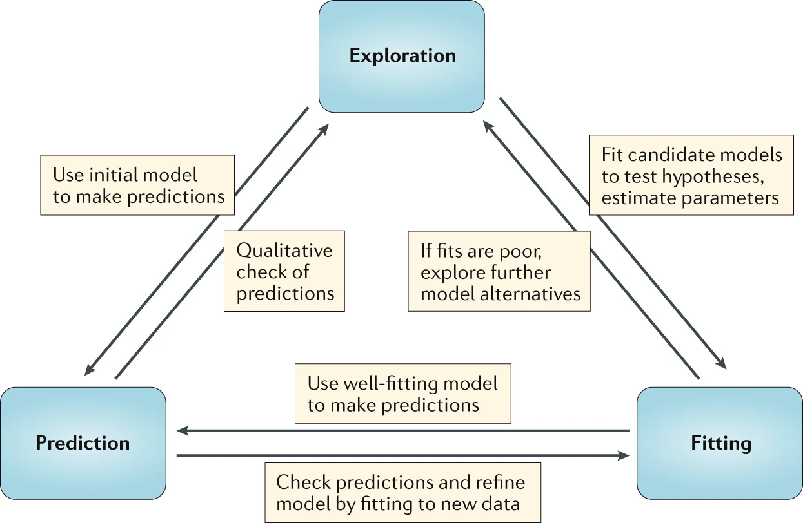

```{r, echo = FALSE}
library(emo)
```


# Overview
Simulation models can be used for different purposes. One way to conceptualize such different uses is shown in this figure.

```{r modelusefig33,  echo=FALSE, fig.cap='Handel et al. 2020 Nat Rev Imm', out.width = '80%', fig.align='center'}

```

# Learning Objectives
* Know what simulation models can be used for.
* Be able to differentiate between model use types.
* Know about advantages and disadvantages of different model use types.


# Slides
We will discuss this topic in one of the zoom sessions. You can get the slides here [as html](./slides/Model_Uses_Slides.html) or [as pdf.](./slides/Model_Uses_Slides.pdf)

# Videos

The recordings of the lecture are broken into three segments. 

The first segment discusses use of models for exploration.

<p>
<iframe width="560" height="315" src="https://www.youtube.com/embed/ZASXPGfm_9M" frameborder="0" allow="accelerometer; autoplay; encrypted-media; gyroscope; picture-in-picture" allowfullscreen></iframe>
</p>


The second segment discusses use of models for prediction.

<p>
<iframe width="560" height="315" src="https://www.youtube.com/embed/PgSI29dqmRs" frameborder="0" allow="accelerometer; autoplay; encrypted-media; gyroscope; picture-in-picture" allowfullscreen></iframe>
</p>

The third segment discusses fitting models to data.

<p>
<iframe width="560" height="315" src="https://www.youtube.com/embed/1MSpAu8ZFXk" frameborder="0" allow="accelerometer; autoplay; encrypted-media; gyroscope; picture-in-picture" allowfullscreen></iframe>
</p>


# Reading


The other units in this module provide more details on each of the different types of model use shown in the figure.


# Further materials

* Our recent review [Simulation Modelling for Immunologists](https://handelgroup.uga.edu/publication/2020-handel-natrevimm/) provides a general introduction to the kinds of simulation models we will be discussing in this course. If you haven't done yet, please read the paper. 

