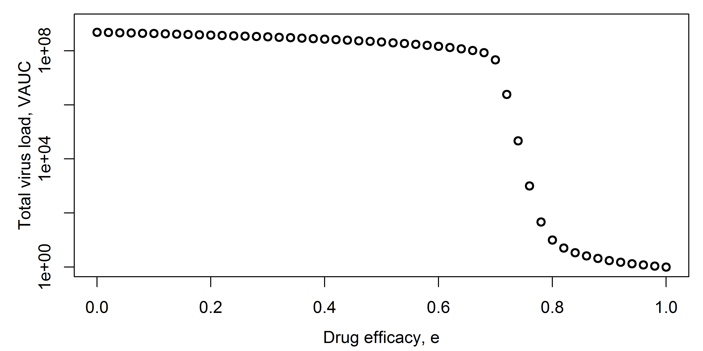
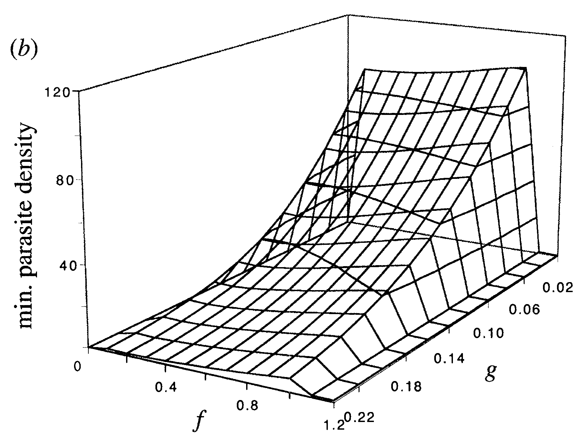
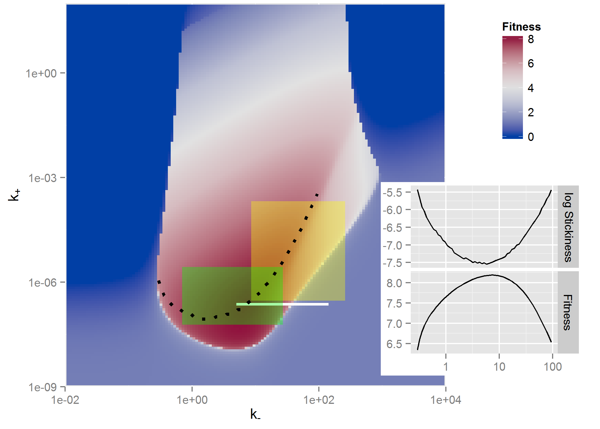

```{r, echo = FALSE}
library(emo)
```


# Overview
This document describes how to use simulation models to explore systems.

# Learning Objectives
* Know when and why to use simulation models for system exploration.
* Be able to implement simple model exploration simulations.


# Introduction 
At the early stages of trying to gain a fairly basic understanding of the behavior of a system, one can build models and explore how interactions between model components (and thus components of the real system) impact observed patterns. Using models in this way provides a quick and cheap way to gain some intuition of how a system functions. For understanding purposes, one generally tries to keep models simple.


# How to use models for exploration
As you are building your model, you will run it and look at the behavior of some, ideally all, model components (your variables). This will produce time-series plots, i.e. you will plot the behavior of the model components as a function of time. Doing so is vital to test your model, debug your code, and make sure everything is working as expected. 

Once you are confident your model and code work as expected, you can move on to the actual analysis and exploration of your system. This can also be done using time-series plots. Let's say you want to know how the model behaves for a set of parameters you consider most reasonable. You set the model parameters to those values, run the model, and report your results. If you want to explore scenarios, e.g. by having some parameter turned off (set to zero) and then turned on, you can produce time-series plots for different scenarios.

At some point, you might shift your interest from the whole time-series to a specific outcome of interest. For instance you might want to know the pathogen peak, the level of antibodies at the end of the infection, or the virus load at steady state. Thus, instead of plotting the whole time-series of all model variables, you are now focusing on a specific component. You often want to know how that outcome of interest varies with some input, the input usually being a model parameter (or combination of parameters). To answer that question, you set the parameter to a value, run the model, record the outcome. Then repeat that process for different values of the parameter. You end up with a set of inputs and outputs, which you can then plot. 


# Model Exploration Examples

For the first example, assume you have a model for an acute virus infection that includes drug treatment, e.g. a model given by these equations: 
$$
\begin{aligned}
\textrm{Uninfected cells} \qquad \dot{U} & = - bUV \\
\textrm{Infected cells} \qquad \dot{I} & =  bUV - d_I I \\     
\textrm{Virus} \qquad  \dot{V} & =  p(1-e)I - d_V V -  bg UV\\ 
\end{aligned}
$$


You want to know how the efficacy of the drug, $e$, affects the total virus load area under the curve (VAUC). You run the model for different levels of efficacy, use the time-series for $V$ to compute VAUC for each simulation, and then plot efficacy of VAUC, as shown in the following figure. 


```{r predictexample,  fig.cap='', echo=FALSE, out.width = '50%' , fig.align='center'}

```


Another example from [@mcqueen2008] shows peak (I~PK~) and total (I~INT~) malaria parasite load as function of binding affinity $\xi$ and immune responsse activation threshold, A~th~. 


```{r malariaexample,  echo=FALSE, out.width="80%", fig.align='center'}
knitr::include_graphics("./media/malariafig.png")
```


Here is another example from [@antia96], where the authors explored an outcome of interest, in this case the minimum TB parasite density, as a function of two model parameters, the rates of transition to dormant (f) and activated (g) state. This illustrates a plot where 2 parameters are varied.

```{r tbexample,  echo=FALSE, out.width="70%", fig.align='center'}

```


And one more example where 2 parameters are varied and a heatmap shown, this one from [@handel14a] where the outcome of interest was virus fitness (similar to VAUC) and how it depends on virion binding (k~+~) and release (k~-~) rates. 

```{r fluexample,  echo=FALSE, out.width="80%", fig.align='center'}

```


The reason I am showing all these examples is to give you an idea of how common the use of models for such a model exploration purpose is. You can find many more examples in the literature where the main purpose for building a model was to gain insights into the behavior of the system. Most often, the models are not detailed enough to allow specific, accurate predictions. But they suggest behaviors that one might find in real systems that are of interest and could be explored further with experiments, more detailed models, or a combination of both.


# When to use models for exploration

Model exploration should be, and inevitably is, always be part of your workflow. Even if your eventual goal is to use your model to fit data or to make predictions, you will always be exploring the model and its behavior to some extent. If you are studying a new system or a system for which not too much data is available, a project that focuses solely on model exploration can be warranted and useful. If you study a system for which you have data, you can do a combination of fitting and exploring the models. Finally, if after enough exploration you decide that your model is a reasonable representation of a real system, you can use it to make predictions. In any case, model exploration is an important part of your project. If you skip this step or don't do it in enough detail, you might end up with a model that makes no biological sense and thus any results obtained from the model are meaningless. 


# References

