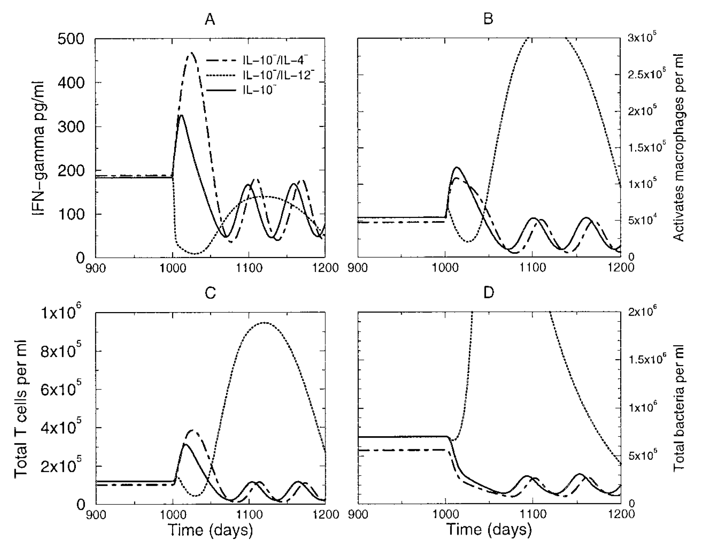

```{r, echo = FALSE}
library(emo)
```


# Overview
This document describes how to use simulation models to make predictions.

# Learning Objectives
* Know when and why to use simulation models for prediction.


# Introduction 
If you have a model that you think is a reasonable approximation of a real system, you can use the model to make predictions. Conceptually, this works the same as using the model for exploration. The only difference is that while for exploration, you interpret your model findings as preliminary, hypothesis generating and subject to further confirmation, in a predictive use of a model you assume that the results from the model can be trusted enough to say something definite, and potentially make decisions, about a real system.


# How to use models for prediction
Once you have gained some general understanding of the system under study and know enough about the system to be able to build models that provide reasonable approximations of the real system, we can use those models to perform _in silico experiments_. You can make predictions what might happen to the system if we changed some of its parts. For instance in a model that includes some cytokine, you could test what would happen if we administered a drug that suppressed this cytokine. This allows you to make predictions that can be tested with further experiments. These _in silico_ approaches are much faster, cheaper and have no ethical problems, compared to real experiments. 

It can be useful to think of predictions as being of the following different types:
  * __Qualitative:__ Try to predict shape/direction of an outcome (similar to the 'exploration' model use).
  * __Semi-quantitative:__ Try to predict the approximate or relative size of an outcome.
  * __Quantitative:__ Try to predict (with confidence intervals) the magnitude of an outcome.


The type of prediction you want to make affect the realism and precision you need in your model. If you want to make qualitative or semi-quantitative predictions, your model needs to be less refined and detailed than if you wanted to make quantitative predictions. 

As an example, assume you have a model that includes both components of the innate response and CD8 T-cells. You want to predict if a change in innate immune activation will lead to more overall cell killing by T-cells. If you are interested in a qualitative/semi-quantitative prediction that tells you if increased innate activation will lead to more T-cell killing or not, and how the overall shape of that relation looks like, a less detailed and precise model might be enough to make useful predictions. If instead you want to predict by what fraction T-cell killing changes if you increase the innate activation by 50%, you need a more precise model. Generally, in my opinion models in immunology are suitable for the first type of prediction, but most are not quite detailed and realistic enough to make quantitative predictions.


# Model prediction examples

Assume we think that the very simple basic bacteria model is a good approximation for a real system we are interested in (that's unlikely for any real system, but let's just pretend for now). The model is given by these equations

$$
\begin{aligned}
\dot{B} & = g B(1-\frac{B}{B_{max}}) - d_B B - kBI\\
\dot{I} & = r BI - d_I I
\end{aligned}
$$


We want to predict the peak burden of bacteria if we were able to increase the induction of the immune response (parameter $r$), e.g. by giving a drug. We'll follow the same approach as for model exploration, namely we run the model for different values of $r$, compute the peak of $B$ from the time-series for each $r$ value, and then plot the results, shown in this figure

```{r nri4,  echo=FALSE, out.width="80%", fig.align='center'}
knitr::include_graphics("./media/nri_review_fig4a.png")
```


The only difference to the model exploration approach is that now we interpret the results as actual predictions instead of suggested findings that need to be further explored.


The following example from [@wigginton01] shows a model for TB infections. The model was used to predict infection outcomes if certain cytokines were to be depleted.

```{r fluexample,  echo=FALSE, out.width="80%", fig.align='center'}

```

Depending on the confidence we have in this model, we can consider the results as definite/predictive and thus actionable (i.e. we might go ahead and try to design a drug based on these model findings), or we might interpret these findings as preliminary and requiring further confirmation (exploration of model). Note that this is an example of a qualitative/semi-quantitative use of the model, the figure shows the overall pattern obtained, the authors did not try to interpret the results in a quantitative sense (e.g. IL-10 depletion leads to a X% drop in bacteria). 


# When to use models for prediction
To make predictions, you need to believe that your model captures the actual dynamics of the real system you are interested in, at least the parts that are important for the question you are trying to answer. This usually happens after models have been built, explored and tested (validated) with data. Once you, or others in your area of research, have gone through this iterative process of model building/testing/validating/adjusting often enough that there is some confidence the model captures the main features of the real system, the model might be ready to be used to make predictions. The kinds of predictions you want to make also affect the point at which you think your model is "ready". If you want to make qualitative or semi-quantitative predictions, your model needs to be less refined and detailed than if you wanted to make quantitative predictions. 

If your model is fairly simple, it is best to stick with qualitative and semi-quantitative predictions. If you want to make precise and detailed predictions, it generally requires very detailed (complex) models. Detailed models are 'data hungry' and often the data are not available. They are also difficult to write and analyze. As such, models that are detailed enough for quantitative predictions are usually not advisable at the beginning of working on a specific system. Once you have a lot of experience with the system and your models and are fairly confident that the model is realistic approximation, you might be able to make quantitative predictions. If you do so, you also need to take into account uncertainty in outputs, a topic we'll discuss later.

Of course the major caveat with any model result is that it is only useful insofar as the model properly captures the important features of the real system. 
__All models makes simplifying assumptions. Thus, predictions are only reliable if the underlying model is a good approximation of the real system.__
The more a model is used to make predictions and these predictions tested with data, the more reliable it becomes.


# References

