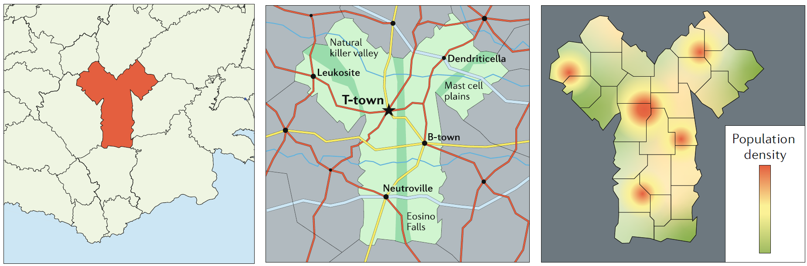

```{r, echo = FALSE}
library(emo)
```


# Overview
This document provides a very brief overview of the idea that models are approximations, and model changes in model structure affect outcomes.

# Learning Objectives
* Understand the need to make simplifying assumptions for models
* Appreciate the concept that model structure and model choices can affect outcome
* Be familiar with approaches that can be used to investigate the impact of different modeling choices


# The need for simplification and abstraction

Every model (computer/mathematical models, a mouse model, and experimental setup) contains some abstraction/simplification to the real world. This applies to small extent even to settings like clinical trials. In those settings, one tries to get close to what would happen (for e.g. a drug or vaccine) in the real world, however the trial setup is still a simplified version of the real world. For computer and simulation models, abstractions are often very strong. This is both a great advantage and disadvantage of such models. One needs to be clear that any choice of simplification when moving from the real system to a model means making assumptions that can influence the outcome.

There are no general rules dictating what simplifications are reasonable to make and which ones are not. It depends on the specifics of the system and the question. Even for the same system (e.g. a single pathogen), different questions will lead to different models.

a good analogy for determining the right level of detail to put into a model is the use of maps. Maps are models of the real world. they serve specific purposes, and it is important that a given map be useful for the intended purpose. Consider the three maps (models) of the fictional country of antibodia (see the figure). If you want to know where this country is located, the left map is useful. if instead you want to know how to drive from t- town to Dendriticella, the middle map would be the most useful. if you want to know where most people live in this country, the right map is most useful. it is the same ‘system’ under consideration (the country of antibodia), but depending on the question, different maps (models) are needed. analogously, for the same biological system under study (for example, a specific pathogen and host), different types of models that include and exclude different details of the systems are needed, depending on the question you want to answer. The usefulness of maps (and models) is that they capture the information that is needed for a specific situation, while ignoring details that are not important for a given question, thus producing the right level of complexity.


```{r mapfigure, echo=FALSE, fig.cap="", out.width="80%", fig.align='center'}

```

# The impact of model choices

Now that we hopefully agree that some simplifying assumptions are necessary and even desirable when building models, we need to acknowledge that any assumption leading to a specific model choice can impact model results. Choices need to be made on multiple fronts. One choice is the decision of which components (variables) one wants to include in the model. Obviously, anything one wants to study should be in the model. The choice to include other components that one does not want to study but that might affect the model behavior is trickier. For instance if we want to study T-cell dynamics, should we include certain components of the innate response? There are arguments in favor and against, and it very much depends on the question and scenario. Unfortunately, there is no recipe to follow (though I advise to start simple and as needed, include more details). Similarly, once the components of the model have been decided, you need to decide what processes should be included. Including more details means the model is potentially more realistic, but it is also harder to analyze and one needs data to specify each model parameter.

Model type is another important consideration. Do you want to use a simple model, such as compartmental ODE model? Do you need a more detailed model like an Agent-based model? The decision what type of model to use should again be dicated by the question.

Once you chose a specific model type, its components and the processes, you still have to make further choices. Most processes can be implemented in different, often equally reasonable ways. 
For instance the following two models are of the same model type, incude the same components and processes, but make different assumptions regarding the details of some of the processes.


### Model 1: Exponential growth of bacteria and mass-action killing by the immune response.

$$
\begin{aligned}
\dot{B} & = g B - d_B B - kBI\\
\dot{I} & = r BI - d_I I \\
\end{aligned}
$$


### Model 2: Constant growth of bacteria and saturating killing by the immune response.

$$
\begin{aligned}
\dot{B} & = g  - d_B B - \frac{kBI}{I+s}\\
\dot{I} & = r BI - d_I I \\
\end{aligned}
$$


For each process/term in the model, there are likely several reasonable ways one can implement the process. The choice which to use is usually guided by known information about the system, ease of use, and convention. 


# The impact of model details

You will have to make specific choices for your model. That is ok and part of the process of building models. Just ensure you always remember that results are contingent on the choices you made, and it is not clear how well they generalize. (Just another reminder that this is not unique to simulation models. If you do an experiment in a BALB/c mouse, it doesn't mean the results would be the same in another type of mouse, let alone in humans). One way to figure out what impact the modeling choices have on outcomes is to explore a lot of different model variants. This quickly gets time-consuming and is rarely done. Occasionally, someone compares models of the same system done by different individuals/groups. A nice example is [@dobrovolny2013c] in which the authors compared several influenza models. By comparing the models to each other and to data, they were able to discuss how models differed and which ones agreed with the data (spoiler alert: there was no one single best model, most of them were good at reproducing some data and not good at reproducing other data).

The following figure shows an example from [@dobrovolny2013c]. I encourage you to glimpse at the paper, it is informative, even if you are not interested in influenza.

```{r dobrovolny, echo=FALSE, fig.cap='Top: models, bottom: data', out.width = '90%', fig.align='center'}

```


# Summary

Different choices for simplifications when building models has a large impact on results. It is unfortunately not possible to explore those impacts in systematic ways, there are too many possible model variants, and building and exploring them is too time-consuming. I suggest for your own modeling practice to explore some variants, just to get some understanding of how different choices lead to different outcomes. For instance if you use a compartmental ODE model, you could re-implement it as a stochastic model and compare results. Or you could change assumptions for some of the processes. I would not try to be exhaustive, e.g. also build an agent-based model or try to include/exclude every immune response component you can think of. It takes too long and you usually don't gain much from doing that.

The main important point is to always keep in mind that model results are just that, results obtained from a model. If you built your model well, there is hope that those results might have some relation to the real world. But that will need to be tested by comparing model results and predictions to data. 


# Practice

* The _Model variant exploration_ app in DSAIRM explores the impact of different model formulations.


# References


