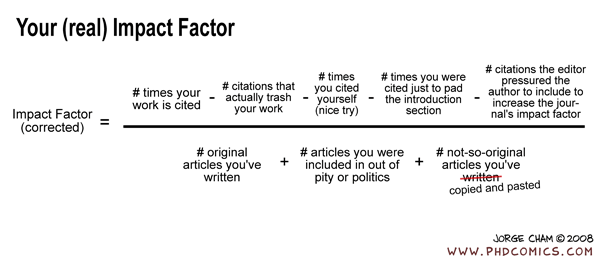

```{r, echo = FALSE}
library(emo)
```


# Overview
While there is no simple recipe that one can follow to ensure successful building and use of a simulation model, there are some guidelines that can help. 


# Stages of Model engagement

For individuals who are not trained in modeling, I often observe stages that could be (a bit flippantly) summarized as follows:

* Ignorance: You don't really know what simulation modeling is, therefore you are not thinking about their potential usefulness.
* Infatuation: You Learned something about models, decided they are cool and should be used. You now want to apply them to all your future question.
* Disappointment: The model building/analysis is hard and doesn't work, the results somehow don't provide much useful answers.
* Discernment: You figured out when and how to use models successfully.

These stages can apply to any new methodology (e.g. new statistical methods, a new fancy experimental system, ...). In all cases, the goal is to move as quickly and painlessly to the stage where the new method is appreciated as a useful tool, you know when and how to use it, and you also know when it's not suitable. 


# Modeling workflow overview
The overall workflow for using a model includes these steps:

1. Have a scenario/question for which a model can provide useful insight (hardest part).
2. Translate your scenario/question into a suitable model (hard).
3. Build and implement the model on a computer
4. Analyze your model, produce results such as figures and tables (fairly easy).
5. Write it all up and try to publish (easy to hard, depends on journal).


# Step 1 - Decide if you need a model

First, you need to decide if a simulation model is useful for your question. This is actually quite hard if you are new to modeling. Simulation models are useful tools, but they are not suitable to answer all types of questions. Sometimes, another experiment is needed. Or a statistical/phenomenological model is the better approach. To avoid wasting time on building a model, just to realize that it can't answer your question, it is good to spend a bit of time and ask yourself what exactly you want to accomplish and how a model can help. In general, questions that are semi-quantitative are very fertile ground for models. In immunology, our models are generally not realistic enough to provide precise quantitative information. For instance you are unlikely to have a precise enough model that can answer a question such as "if I double drug dose, by how many hours do I reduce the time until pathogen clearance?". You might also not need a model for the qualitative question "if I increase drug dose, does this lead to faster pathogen clearance?". Unless you have a bad drug or something strange is going on in your system, the answer is likely "Yes". But a model could be quite useful for semi-quantitative questions such as "as I increase drug dose, does time to clearance reduce linearly, or is there some threshold effect?".

__Coming up with an important/relevant question where a model can be useful is the most important component.__

```{r modelgoal,  echo=FALSE, fig.cap='dilbert.com', out.width = '100%', fig.align='center'}

```


# Step 2 - Decide what matters 

Once you decided that a model is useful for your question, you have to address the first point discussed in the _What influences model results_ section, namely the structure of your model. You need to decide on the type of model and the details to include. As a reminder, reality is so complicated that you can never (and don’t want to) include every detail into a model. Therefore, models are always approximations of the real world. A good model is one that includes the details important to your question, and ignores details that do not matter for the question you are trying to answer.

Remember the map analogy. Depending on your question (where am I, how do I get from A to B, where do most people live) a different map (model) is needed. 

```{r mapfigure, echo=FALSE, fig.cap="", out.width="80%", fig.align='center'}
knitr::include_graphics("./media/nri_review_modeldetail.png")
```

__Getting the model structure and details right is hard, and distinguishes good models/modelers from those that aren't quite as good.__ Unfortunately, there is no recipe, but there are some guidelines that I suggest are useful to follow, at least initially as you learn modeling.

I generally recommend starting with a simple model. It's easier to build and easier to understand. ODE models are good starting points. Start out by only including the most essential components and processes you know you need to answer your question. Explore this model. You can think of it as _version 1_ or _prototype_. As you do some initial explorations of the model, you will likely realize that you need to make modifications and possibly add further details. It's easier to start simple, understand the simple model, then expand, than doing the reverse. If you start with a complicated model, there is so  much going on that you might have a hard time figuring out if individual processes behave the way they should.


```{r physicist,  echo=FALSE, fig.cap='xkcd.com', out.width = '70%', fig.align='center'}
knitr::include_graphics("./media/xkcd_approximation_physicists.png")
```

Of course, as you get more experienced, you can move to more complicated models. But always make sure you understand how your model behaves as much as possible.  


# Step 3 - Build and implement your model 

Once you decide on the model structure and what components and processes to include, draw diagrams of the model components and interactions. You can and should do that no matter what type of model you plan to build. If you do an ODE model, write down the equations. Writing down the equations might be a good exercise even if you will use a more complicated model eventually. Go back and forth between the verbal form of your processes, the diagram and the equations to make sure they all agree.

As an example, if we have the simple bacteria-immune response (predator-prey) model shown below, one process is "bacteria are killed by the immune response at a rate that is proportional to both bacteria and immune response levels". The 

```{r nribacteria,  out.width = '80%', echo=FALSE, fig.align='center'}
knitr::include_graphics("./media/nri_review_fig3a.png")
```


$$
\begin{aligned}
\dot{B} & = g B(1-\frac{B}{B_{max}}) - d_B B - kBI\\
\dot{I} & = r BI - d_I I
\end{aligned}
$$

Once your model is fully specified, you need to implement it in some programming language. That might initially seem the hard part of the project, but given the availability of fairly user-friendly software, and with some practice, the model implementation will become easy. In fact, this part requires the least creativity and scientific thinking, it's mainly just 'turning the crank' to get the model written.


```{r writecode,  echo=FALSE, fig.cap='xkcd.com', out.width = '60%', fig.align='center'}
knitr::include_graphics("./media/xkcd_compiling.png")
```

Definitely when you start out, but even when you have been coding for many years, expect that the first version of your code will contain bugs. As you try to run your model, it will either not run or produce weird results. Figure out what's going wrong, fix, try again. Repeat until you are certain that there are no bugs in your code **and** also no problems with your conceptual/mathematical model. A good strategy for testing is to look at individual components and make sure they work. For instance in the absence of the pathogen, are cells produced and die as you would expect? Does the immune response behave as you would expect if there is no pathogen? If there is a pathogen present but all immune response components are turned off, do you see what you would expect and something that makes biological sense? By setting certain variables and parameters to zero initially, you can test different model components and make sure they behave as they should. Testing extremes where you know what you should be getting is a good strategy (e.g. if you set activation/growth rate of T-cells to zero, you know that there should be no increase in those numbers).

```{r goto,  echo=FALSE, fig.cap='xkcd.com', out.width = '100%', fig.align='center'}
knitr::include_graphics("./media/xkcd_goto.png")
```


# Step 4 - Analyze model and produce results

Finally, once the model works as expected, analyze it. Run simulations in such a way that you get the outcomes you are interested in. Analyze results by looking at outputs. Figures are especially good.


```{r pandemicsim,  echo=FALSE, fig.cap='dilbert.com', out.width = '100%', fig.align='center'}
knitr::include_graphics("./media/dilbert_flupandemic.gif")
```

If you fit models to data, look at the quality of the fits graphically. If you don't fit, compare your model results with whatever you know in general about the system and what you expect to see. As needed (very likely) adjust model. Keep iterating until the model "works".

```{r experiments,  echo=FALSE, fig.cap='', out.width = '90%', fig.align='center'}
knitr::include_graphics("./media/phd_whocaresaboutexperiments.gif")
```

Once you have your final model(s), produce final results and turn into publishable products (good looking figures, tables, etc.).


__A note on model "failures":__ If you built a reasonable model and it wasn't able to reproduce reality, you have learned something. You learned that the mechanisms you thought described the system did not (fully) do so. This is useful to report in your paper. It's hard to publish something that says "we built a reasonable model but it didn't agree with the data". So you'll likely have to modify your model until it "works". However, knowing that certain plausible models did not do a good job is useful information, so I encourage you to report that.


# Step 5 - Write up and publish

The process of writing your paper and getting it published can be fairly easy or tedious, often depending on luck with journals and reviewers. 

For paper writing, everyone has their own workflow. I recommend one that is as reproducible as possible, and if you use R to build your models, you might want to write your paper using RMarkdown (or bookdown). If you want to learn a bit more about this topic, I recommend reading through the _GitHub_, _RMarkdown_ and _Reference Management_ sections in the _Tools Overview_ module of my [Modern Applied Data Analysis course](https://andreashandel.github.io/MADAcourse/), as well as the _Data analysis overview_ module  of that course. While that course focuses on data analysis using phenomenological/statistical models, not simulation models, almost all of the concepts explained there for the general setup of a project apply for simulation model based projects as well. (The _Visualization_ module of that course might be of interest to those that plan on using R and wanting to learn how to make publication quality figures.)


If you are new to trying to get papers published, I gave a presentation to our PhD students where I give some suggestions (among other topics) on how to publish papers. You can find this presentation [here](https://www.andreashandel.com/talk/2020-02-reading-managing-publishing-papers/) if you are interested.


```{r publish,  echo=FALSE, fig.cap='', out.width = '100%', fig.align='center'}

```

# Further Reading

* In our review paper [Simulation Modelling for Immunologists](https://handelgroup.uga.edu/publication/2020-handel-natrevimm/), we discuss these topics and provide a few more complementary pointers.


