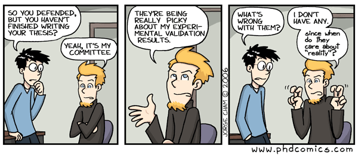

```{r, echo = FALSE}
library(emo)
```


# Overview
The same concepts and guidelines that apply to building good models can be applied when assessing models and their results built by others. Even if you decide that modeling is not for you, you will likely come across papers in the literature that use models. It is thus useful to understand enough about modeling to be able to critically assess the reported results. The following guidelines might help.


# Overall assessment

Similar to the question "do I need a model" when building one, you should ask "did they need a model" when reading a paper. Did the model help answer a question that could not have been answered without the model? Do the authors use the model in a qualitative, semi-quantitative or quantitative manner? Is the way they use it justified by their question, data and model?


# Model structure assessment

Again, when you build a model, you have to decide the right type and complexity. When you read a modeling paper, you should ask yourself if the authors chose the right type and included/excluded the right amount of details for the question they were addressing. If the model is simple, does it include details important for the question? If the model is complex, are the model parameter values well supported by available data? 


```{r mapfigure, echo=FALSE, fig.cap="", out.width="80%", fig.align='center'}
knitr::include_graphics("./media/nri_review_modeldetail.png")
```


# Quality of model implementation and description
To evaluate if the model structure is good, it is important that the authors cleary describe their model. Thus, ask yourself these questions:

* Are the assumptions made in building the model clearly described and justified?
* Is the model properly implemented and well described?
* Are diagrams and equations (if applicable) shown?
* Are enough details provided that someone could re-implement their model?
* Is the model code freely available?

The last two questions are not necessarily indicative of model quality and appropriateness. However, with the move toward reproducible and open science, it is important to be able to inspect a model and the model code in detail. That allows finding of bugs, makes it clear how authors implemented the model, and can also lead to further scientific advances if someone uses their model to answer further questions. As such, I consider full availability of code of ever increasing importance (and I insist on it being present when I review papers `r emo::ji('smiley')`).


# Quality of model analysis

If, after evaluating the paper thus far, you decide that the model is not appropriate for the question asked, you can stop reading. A fundamentally wrong model won't give any useful results. Move on to the next paper. But if you conclude that the model is reasonable, you want to move on to the analysis and results that are performed. For that, ask yourself these questions:

* What is the model used for, and is that clearly explained?
* Is a thorough analysis performed?
* Do the authors discuss when/how the model _fails_ and what that means? This is often informative.
* If the model 'works', do the authors discuss why/how?
* How generalizable are the results?  
* If the model is used for prediction, is some type of uncertainty and sensitivity analysis included?
* If the model is fit to data, are there checks for overfitting? 
* If there was no fitting of data, do the authors compare model results to data?
  * What kind of comparison is done?
  * Is the comparison convincing?

```{r experiments,  echo=FALSE, fig.cap='', out.width = '100%', fig.align='center'}

```


# Model interpretation

* Are claims consistent with methods and results?
  * A very simple model is likely not suitable for detailed predictions.
  * A complicated model is likely not reliable if the model inputs have lots of uncertainty or the model assumptions are not acceptable.
* If model use is exploratory/qualitative, are authors clear about this?
* If model is meant to predict, are levels of uncertainty provided? What kind of uncertainty is considered? 


# Summary 
Critically assessing a modeling study is not that much different than other types of studies. For instance a paper that includes some sophisticated experimental procedure, or some sophisticated statistical analysis using phenomenological models should be assessed in pretty much the same way. In all instances, some familiarity with the methods and approaches is needed to make a useful judgment call. It is worth keeping in mind that any such approach, including simulation models, are almost always used as tools to answer a question, not as the final end product (unless it's a methods paper). As such, it is important to keep in mind that while models are useful tools, they are not magic. Results are only as good/reliable as the quality of the underlying model. If in doubt about the quality/reliability of a modeling study, ask an expert.


# Further Reading
* [@handel2020c]
* [@basu13] 
* [@garnett11]


# References

