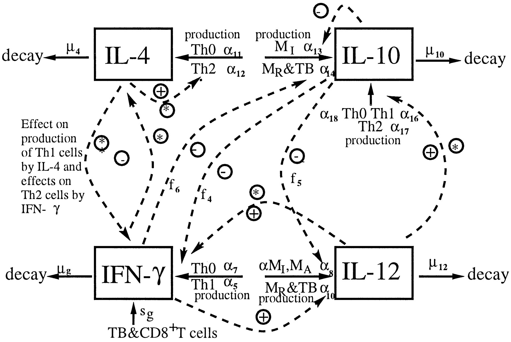
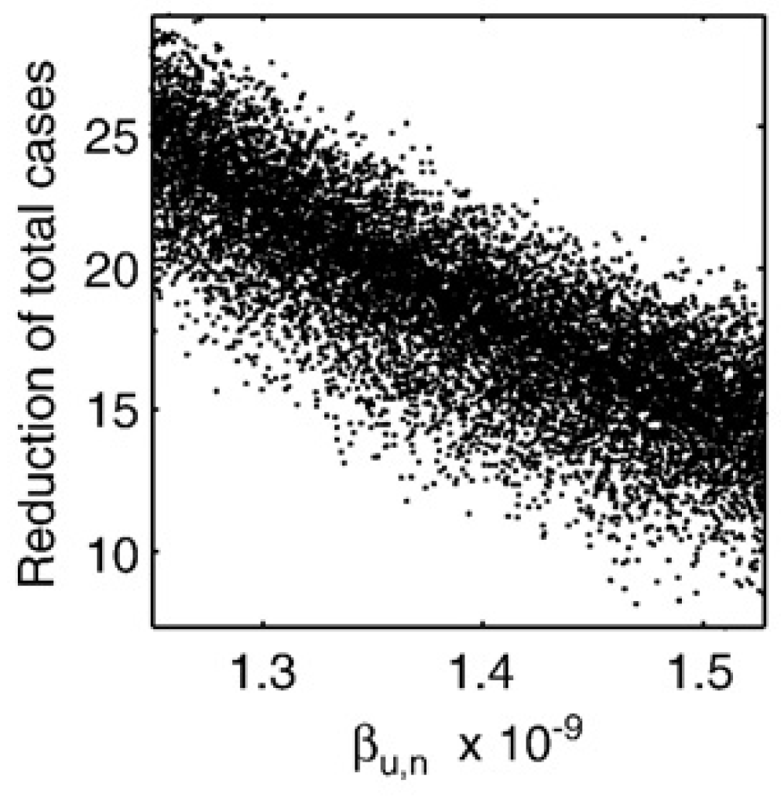

```{r, echo = FALSE}
library(emo)
```


# Overview
This document describes how uncertainties in model parameters lead to uncertainties in model outcomes and how one can evaluate the impact of parameter changes on outcomes using uncertainty and sensitivity analysis.


# Learning Objectives
* Appreciate the impact of parameter uncertainty on model results
* Understand how to sample parameters from different distributions
* Know the idea behind Latin Hypercube sampling
* Understand what uncertainty analysis is
* Understand the idea of sensitivity analysis


# The problem of parameter uncertainty

We discussed before that to run a model, one needs values for the model parameters. Those are not always well known. Often we can get reasonable ranges from the literature, but not exact values. If a model only has a few parameters, one can potentially explore model outcomes over the range of plausible values for all those parameters. We discussed this approach under the _Model Exploration_ topic. However, if a model becomes large and has many parameters, that is not feasible anymore. Also, we might often only be interested in one or a few of the model parameters and how they affect some outcome. We need to take into account uncertainty in the other parameters, but we might not want to explore this in detail. In other situations, we might want to use our model to make predictions, taking into account uncertainty in the model inputs (parameters, as well as initial conditions). 


As an example for a large model, we consider a model of TB infection, published in [@wigginton01]. The model has a total of 12 equations/compartments tracking the bacteria and different components of the immune response, and a total of 66 model parameters. The figure below shows the diagram for one of the cytokine component of the immune response included in the model, the table shows the parameters for this component. 

```{r tbexample1,  echo=FALSE, out.width="70%", fig.align='center'}

```


```{r tbeq1,  echo=FALSE, out.width="90%", fig.align='center'}
knitr::include_graphics("./media/tbfig5.png")
```

It is clear that one cannot do a systematic exploration of all 66 parameters. One can then instead turn to an approach called uncertainty & sensitivity (U/S) analysis. 

# Uncertainty & Sensitivity Analysis

The idea for U/S analysis is rather straightforward. Instead of giving each parameter a single value, you specify distributions between reasonable values. Then draw samples from these parameter distributions and run the model for those samples. Record the outcomes of interest for each parameter sample, then plot the distribution of outcomes.

The uncertainty analysis part answers the question: Given uncertainty in the inputs, how much uncertainty is there in the outputs/results? This is achieved by plotting the distribution of outcomes (e.g. using a boxplot). The sensitivity analysis part answers the question: How much do individual inputs contribute to the uncertainty in outputs/results? This can be addressed with for instance a scatter plot with one of the parameters on the x-axis and the outcome in the y-axis. Other ways are described below.


# Specifying parameter ranges
First, you need to determine distributions for each parameter. If you are confident about the value for certain parameters, you can fix them. If you only have reasonable upper and lower bounds but no further information, you can assume a uniform distribution. We can almost always set bounds even if we know very little about a system. Assume we want to model the death rate of some cell type (e.g. NK cells) in humans. We might not know anything, but we can still be fairly confident that their lifespan is at least 1 second and less than 100 years. That's of course a wide range and we should and usually can narrow ranges further, based on biological knowledge of a given system.

Peaked distributions are also useful if you have a good idea of the mean of the parameter but want to allow for some spread. Normal distributions are not ideal since they allow negative values, which usually doesn't make sense for our parameters. The gamma distribution is a better idea, since it allows positive values. Log-normal are also useful, or beta-distributions if your parameter is bound between 0 and 1.

It turns out that in practice, the exact shape of the distribution usually matters little and uniform distributions for all parameters are easy and usually fine (they tend to be conservative since they allow equal probability across the whole range of reasonable values). Of course the choice of the distribution is subjective (like choosing a prior in Bayesian statistics). So make sure to provide reasonable scientific justification for the choices of your parameter ranges.


# Sampling parameters
Once you have the ranges, you draw a certain number of samples for the set of model parameters, which can also include initial conditions for your variables, those can be treated as parameters for the purpose of U/S analysis. The naive way is to draw random samples, however that does not lead to very good coverage of the parameter space. Grid sampling, where you divide distributions of parameters into bins and sample from each, will ensure comprehensive coverage of the parameter space, but requires a lot of samples. A method called Latin Hypercube Sampling (LHS) can perform sampling that covers the parameter space fairly efficiently even with a fairly low number of samples. For more technical details, see e.g. [@saltelli2004]. The R package `lhs` has functions for that. 


# Evaluating outcome uncertainty

Once we specify the ranges for each parameter, the sampling method, and the number of samples, the simulation draws that many samples, runs the model for each sample, and records outcomes of interest. While the underlying dynamical model returns a time-series for each sample, we are usually not interested in the full time-series. Instead, we are interested in some summary quantity. For instance, we might be interested in the maximum/peak pathogen level during an infection. We can run the simulation for multiple samples and record the outcome of interest for each parameter sample/simulation. The most basic question we can then ask is "how does uncertainty in the parameters lead to uncertainty  in our outcomes of interest". This can be graphically represented with a boxplot.

The figure below shows an example of a boxplot for some U/S analysis. For different intervention strategies (along the x-axis), samples are run and some outcome is recorded. 

```{r uncertainty,  echo=FALSE, out.width="70%", fig.align='center'}
knitr::include_graphics("./media/uncertainty.png")
```


# Evaluating outcome sensitivity to specific parameters

If you want to know how individual parameters affect outcomes, you can plot that parameter on the x-axis and the outcome of interest on the y-axis, leading to a scatterplot, like this one.


```{r sensitivity,  echo=FALSE, out.width="70%", fig.align='center'}

```

If the scatterplot shows a monotone relation, you can summarize it with a single number, e.g. a correlation coefficient (a regression coefficient is possible too). Correlation Coefficients (CC) indicate how correlated a given output is with a given input. CC are between -1 and 1. Large CC means strong (negative) correlation, CC $\approx 0$ means no correlation. Since of the kinds of models we explore, the impact of parameter changes on the outcomes is often nonlinear, linear correlation coefficients (the standard Pearson correlation) is often not the best measure. Rank CC (such as Spearman's or Kendall's CC) are usually more suitable. Partial Rank Correlation Coefficients (PRCC) are even better since we change multiple inputs/parameters at the same time and we are interested in the relation between a single parameter and the outcome, while taking into account changes in the other parameters.

# Practice
To learn more about U/S analysis and explore it yourself, see The "Parameter Uncertainty" app in DSAIRM.

# References