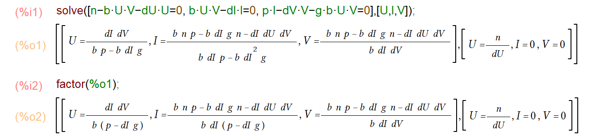

```{r, echo = FALSE}
library(emo)
```


# Overview
This document provides an introduction to steady states and how to compute them.

# Learning Objectives
* Be familiar with steady states.
* Know how to compute steady states.


# Reading

Often (but not always), biological systems can settle into an approximately steady state, where the numbers of the quantities being tracked barely change. An example for this is HIV during the chronic phase. While there are still large numbers of virions produced each day, and Cd4 T-cells are being generated and destroyed, the overall balance between virus and T-cells reaches a state that is fairly constant over short time spans (of course over years, there is a slow decline of T-cells, which if untreated eventually leads to AIDS). 

If one has a model for such a system, one can often compute this steady state mathematically. This works for simple models. Once the models get more complex, doing the math gets hard or impossible. It is however always possible to run the simulation long enough until the system has settled down to the steady state - provided the system/model has such a steady state. Not all systems/models do. For instance during an acute infection, the pathogen grows, then declines, without ever reaching a steady level (other than absence of pathogen, which can be considered a steady state). Similarly, in some systems there might be continuous cycles of increase and decrease without ever settling down.

Below, we assume a steady state exists and look at a few simple models introduced earlier to show how the steady state can be computed and interpreted.


## The One-compartment Model

Recall the one-compartment model that tracked some population of entities (pathogens/immune cells/humans/animals) that grow or die, and that included saturating growth.
The discrete-time version of the model was

$$
P_{t+dt} = P_t + dt ( g P_t(1-\frac{P_t}{P_{max}}) - d_P P_t )
$$

the continuous-time, ODE version was

$$
\dot P  = gP(1-\frac{P}{P_{max}}) - d_P P
$$

If the system is in a steady state, it means the variables do not change. Translated to the model, it means in the first model that $P_{t+dt} = P_t$ or equivalently for the ODE model $\dot P = 0$.

This turns the dynamic differential- or difference-equation model into a simple algebraic equation. We can then often (at least for simple models) solve for the model variables and get an equation that shows the values of the variables at steady state only as function of model parameters. Let's do that for the ODE model. Starting with

$$
0  = gP(1-\frac{P}{P_{max}}) - d_P P
$$

we can rewrite as 

$$
gP(1-\frac{P}{P_{max}}) = d_P P
$$
now divide by $P$ and $g$ on both sides to get

$$
(1-\frac{P}{P_{max}}) = \frac{d_P}{g}
$$

next a bit of subtraction and addition to isolate the $P$

$$
\frac{P}{P_{max}} = 1 - \frac{d_P}{g}
$$
and finally multiply by $P_{max}$ to obtain $P$ at steady state as a function of model parameters.

$$
P = P_{max}(1 - \frac{d_P}{g})
$$

This equation tells us how $P$ at steady state depends on the parameters. We can see that as the carrying capacity $P_{max}$ increases, so does the steady state value of $P$. We can also see that if the death rate of the bacteria is higher than the growth rate ($d_P>g$) then (1 - \frac{d_P}{g}) and thus $P$ becomes negative. A negative number of $P$ obviously makes no biological sense. It is an indication that if death exceeds maximum growth, there can't be a steady state. All of these findings make sense and we can get them straight from the equation, without having to run simulations. Unfortunately, once models become larger, doing it with the computer is often the only option.

For completeness, let's go through the same process for the discrete-time model. With $P_{t+dt} = P_t$ we get

$$
0 = dt ( g P_t(1-\frac{P_t}{P_{max}}) - d_P P_t )
$$

Once you divide by $dt$, the equation is the same as above, thus you find the same steady state. Note that since parameters in discrete-time and continuous-time models can have slightly different biological interpretations (namely rate versus per-timestep change), you should always compute the steady state for your specific model.


## Basic Bacteria Model

Let's go through the process again, this time for a model with two variables, namely the basic bacteria model you encountered previously. We'll only look at the ODE formulation here, you can work your way through the discrete-time version as an exercise.

Here is the model again:

$$
\begin{aligned}
\textrm{Bacteria} \qquad \dot{B} & = gB(1-\frac{B}{B_{max}}) - d_B B - kBI \\
\textrm{Immune Response} \qquad \dot{I} & =  rBI - d_I I     
\end{aligned}
$$
A steady-state condition means the variables do not change, thus the left-hand side of the model becomes 0 and we get

$$
\begin{aligned}
0 & = gB(1-\frac{B}{B_{max}}) - d_B B - kBI \\
0 & =  rBI - d_I I     
\end{aligned}
$$
Now we go through the same process of solving these equations until we have $B$ and $I$ on the left side, and some combination of parameters on the right side. 

:::{.note}
If you recall from your math classes, what we are doing is solving N algebraic equations with N unknowns. You might remember that this doesn't always work, sometimes there is no unique solution. We ignore that for now, and only focus on the steady state at which both bacteria and immune response are present (and which exists for this model). But it's important to keep in mind the possibility of multiple or no solutions, especially when your models get larger and you can only explore them by simulation.
:::

We start by solving the bottom equation, which is easy. We divide by $I$, move the $d_I$ term to the other side and then divide by $r$ to get

$$
B = \frac{d_I}{r}
$$

From this equation, you can immediately determine how the steady state level of bacteria depends on model parameters. Maybe surprisingly, the steady state value for the bacterial __only__ depends on the rate of growth and death of the immune response, not any bacteria-related parameters. This shows that even for simple systems, some of the results might not be easy to intuit (and why we need models to study those systems `r emo::ji('smile')`.

Getting $I$ from the first equation takes a few more steps. First we re-arrange to get

$$
gB(1-\frac{B}{B_{max}}) = d_B B + kBI 
$$

Now, divide by $B$ and reshuffle such that we only have $I$ by itself.

$$
\frac{g(1-\frac{B}{B_{max}}) - d_B}{k} =  I 
$$
Finally, we insert the result for $B$ we got above and clean up a bit

$$
I = \frac{ r B_{max} (g-d_B) - d_I g}{k r B_{max}} 
$$

While this expression is a bit more complex, you can still see how various model parameters influence the steady state value of $I$.


## Basic Virus Model

Let's do it for one more model, the basic virus model. Without birth and death of uninfected cells, we can only get a single outbreak and no steady state at which both virus and cells are in an equilibrium. Thus, we include those processes in our model, which is then given as follows. 


$$
\begin{aligned}
\textrm{Uninfected cells} \qquad \dot U & = n - d_U U - bUV \\
\textrm{Infected cells} \qquad \dot I & = bUV - d_I I \\
\textrm{Virus} \qquad \dot V & = pI - d_V V - gb UV \\
\end{aligned}
$$

The process should be familiar by now. We set the left side to zero, then solve for $U$, $I$ and $V$ such that we end up with equations that only have parameters on the right side. 
While conceptually not hard, it starts to get a bit messy. This is where certain software can help you (see _Resources_ below). Here is a screenshot of doing this using [Maxima](https://maxima.sourceforge.io/index.html).

```{r virus_ss_maxima,  fig.cap='', echo=FALSE, fig.align='center'}

```

You can see that there are two steady states, the first one is the one we are interested in, which corresponds to a chronic infection. It gets a bit harder to read off from the equations how certain parameters influence the results, but you can still do it.

Once the model gets larger (generally 4+ equations), results get so messy (and at some point unfeasible to compute) that you'll have to resort doing it numerically. 


# Practice

You can further explore the steady state ideas with several of the apps in DSAIRM. You can try to compute them yourself, then compare to the simulation results. They should agree.


# Resources

Often, doing these mathematical computations by hand can get tedious. There are several software packages that allow solving equations like the ones above. The two main products are [Mathematica](https://www.wolfram.com/mathematica/) and [Maple](https://www.maplesoft.com/products/Maple/). Both are very powerful, but also can be quite expensive. A free alternative is is [Maxima](https://maxima.sourceforge.io/index.html). It's not quite as full-featured, but I find it often does the job. 


