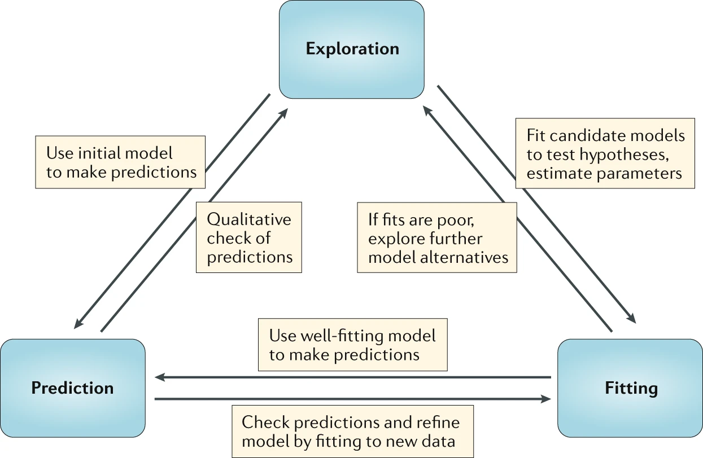

```{r, echo = FALSE}
library(emo)
```


# Overview
Simulation models can be used for different purposes. One way to conceptualize such different uses is shown in this figure.

```{r modelusefig33,  echo=FALSE, fig.cap='Handel et al. 2020 Nat Rev Imm', out.width = '80%', fig.align='center'}

```

# Learning Objectives
* Know what simulation models can be used for.
* Be able to differentiate between model use types.
* Know about advantages and disadvantages of different model use types.

# Content

Each of the model uses shown in the diagram above is covered in a separate unit. Each unit contains both a video recording and written text. The content of the recordings and the writings overlap substantially. 


# Further materials

* Our recent review [Simulation Modelling for Immunologists](https://handelgroup.uga.edu/publication/2020-handel-natrevimm/) provides a general introduction to the kinds of simulation models we will be discussing in this course. If you haven't done yet, please read the paper. 

