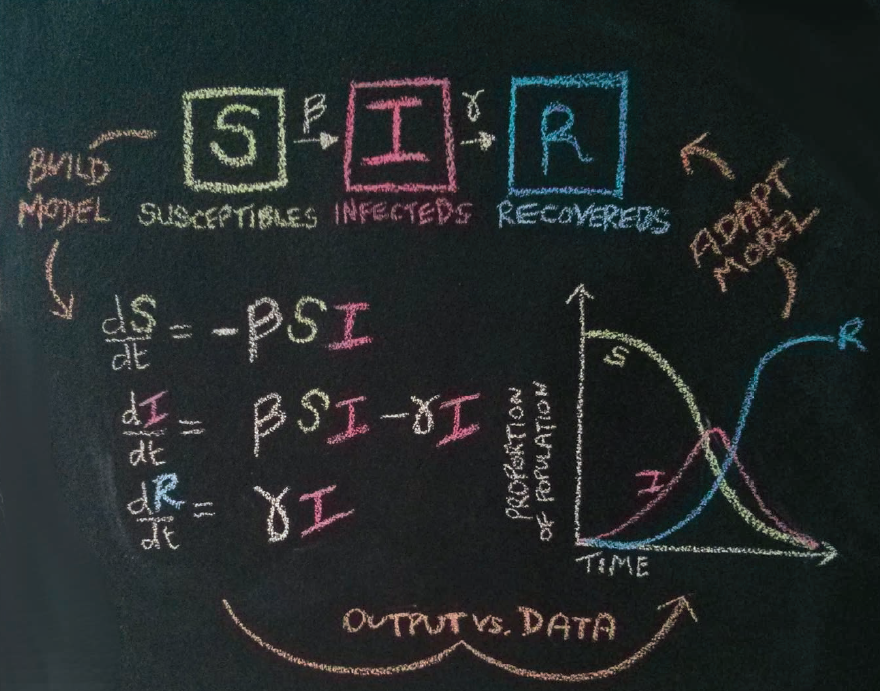
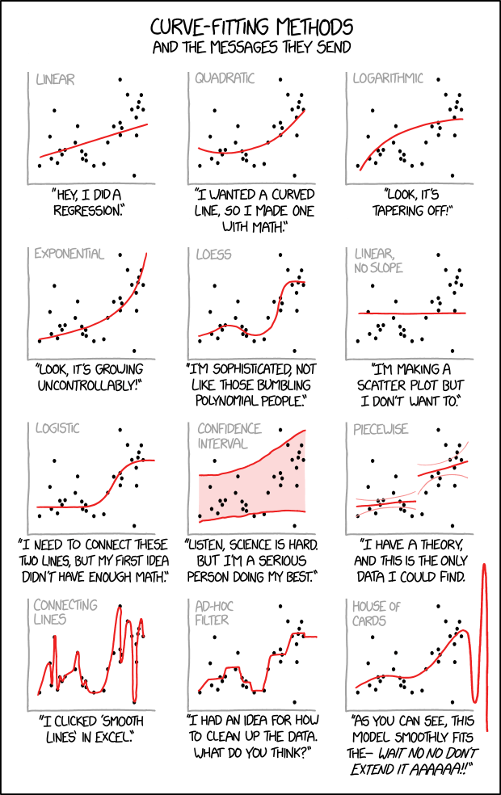
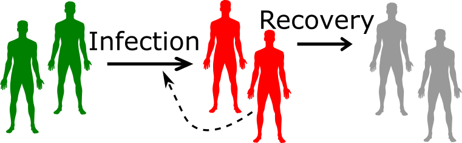
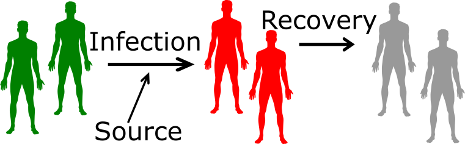

## How do we do science?

```{r doingscience,  echo=FALSE, fig.cap='dilbert.com', out.width = '100%', fig.align='center'}
knitr::include_graphics("./media/dilbert-debunking-science.gif")
```


## How do we get data?

```{r doingscience2,  echo=FALSE, fig.cap='xkcd.com', out.width = '50%', fig.align='center'}
knitr::include_graphics("./media/xkcd_artifacts.png")
```


## Experimental studies

<div style="float: left; width: 50%;">
* The approach used in almost all bench/lab sciences.
* Clinical trials in Public Health and Medicine.
* Potentially most powerful because we have most control.
* Not always possible.
</div>

<div style="float: right; width: 50%;">
```{r expstudies,  echo=FALSE, fig.cap='xkcd.com', out.width = '80%', fig.align='center'}
knitr::include_graphics("./media/xkcd_blind_trials.png")
```
</div>


## Observational studies
* Widely used in Public Health and other areas (e.g. Sociology, Geology).
* Not as powerful as experimental studies.

```{r obsstudies,  echo=FALSE, fig.cap='(c) Jim Borgman', out.width = '70%', fig.align='center'}
knitr::include_graphics("./media/studies-produce-random-results.png")
```

* Often the only option.


## Simulation/modeling studies

* Computer models can represent a real system.
* Simulated data is not as good as real data.

```{r modelstudies,  echo=FALSE, fig.cap='xkcd.com', out.width = '100%', fig.align='center'}
knitr::include_graphics("./media/xkcd_algorithm_help.png")
```

* Often the only option.


## Modeling definition

* The term __modeling__ usually means (in science) the description and analysis of a system using mathematical or computational models. 

<div style="float: left; width: 50%;">
```{r modelcouple,  echo=FALSE, fig.cap='Not this', out.width = '60%', fig.align='center'}

```
</div>

<div style="float: right; width: 50%;">
```{r modelsketch,  echo=FALSE, fig.cap='This one', out.width = '70%', fig.align='center'}

```
</div>


* Many different types of modeling approaches exist. Simulation models are one type (with many subtypes).

## A way to classify computational/mathematical models


* __Statistical/phenomenological models__
  * Look at patterns in data
  * Do not describe mechanisms leading to the data
* __Mechanistic/process/simulation models__
  * Try to represent simplified versions of mechanisms
  * Can be used with and without data


## Phenomenological/Non-mechanistic models

<div style="float: left; width: 50%;">
* You might be familiar with statistical models (that includes Machine Learning, AI, Deep Learning,...).
* Most of those models are phenomenological/non-mechanistic (and static).
* Those models are used extensively in all areas of science.
* The main goal of these models is to understand data/patterns and make predictions.
</div>

<div style="float: right; width: 50%;">
```{r curvefitting2,  fig.cap="xkcd.com", echo=FALSE, out.width = '80%', fig.align='center'}

```
</div>


## Non-mechanistic model example 1

```{r phenomodel1,  fig.cap="Impact of duration of infection on outbreak size. The fit model is $F = b_0 + b_1 D +b_2 D^2 + b_3 D^3$. ", echo=FALSE, out.width = '80%', fig.align='center'}
knitr::include_graphics("./media/phenoexample.png")
```


## Non-mechanistic model example 2

```{r phenomodel2,  fig.cap='Impact of drug dose (C) on virus load (area under the curve, AUC). The function AUC = $V_{max} (1-\\frac{C}{C+C_{50}})$ is fit to the data.', echo=FALSE, out.width = '50%', fig.align='center'}
knitr::include_graphics("./media/phenomodel.png")
```

## Non-mechanistic models - Advantages
* Finding correlations/patterns is (relatively) simple.
* Some models are very good at predicting (e.g. Netflix recommender, Google Translate).
* Sometimes we can go from correlation to causation.
* We don't need to understand all the underlying mechanisms to get actionable insights.

```{r xmkcml,  fig.cap="dilbert.com", echo=FALSE, out.width = '100%', fig.align='center'}
knitr::include_graphics("./media/dilbert-machine-learning.gif")
```


## Non-mechanistic models - Disadvantages

<div style="float: left; width: 50%;">
* The jump from correlation to causation is always tricky (bias/confounding/systematic errors). 
* Even if we can assume a causal relation, we do not gain a lot of mechanistic insights or deep understanding of the system.
</div>

<div style="float: right; width: 50%;">
```{r mldilbert,  fig.cap="xkcd.com", echo=FALSE, out.width = '100%', fig.align='center'}
knitr::include_graphics("./media/xkcd-machine_learning.png")
```
</div>


## Mechanistic models
* We formulate explicit mechanisms/processes driving the system  dynamics.
* This is done using mathematical equations (often ordinary differential equations), or computer rules.
* Also called _systems dynamics models_ or _(micro)simulation models_.

```{r idprocess,  fig.cap="", echo=FALSE, out.width = '80%', fig.align='center'}

```

$$
\begin{aligned}
\dot S & = -bSI \\
\dot I & = bSI - g I \\
\dot R & = g I \\
\end{aligned}
$$


## Mechanistic model example 

```{r predictexample2,  fig.cap='Total virus load (VAUC) as function of drug efficacy, e.', echo=FALSE, out.width = '50%', fig.align='center'}
knitr::include_graphics("./media/predictexample.png")
```

$$
\begin{aligned}
\textrm{Uninfected Cells} \qquad \dot{U} & = n - bUV -mU \\
\textrm{Infected Cells} \qquad \dot{I} & =  bUV - d_I I - mI\\     
\textrm{Virus} \qquad  \dot{V} & =  p(1-e)I - d_V V -  gb UV
\end{aligned}
$$


## Mechanistic models - Advantages
* We get a potentially deeper, mechanistic understanding of the system.
* We know exactly how each component affects the others in our model.

```{r idprocess2,  fig.cap="", echo=FALSE, out.width = '80%', fig.align='center'}

```


$$
\begin{aligned}
\dot S & = -bSI \\
\dot I & = bSI - gI \\
\dot R & = gI \\
\end{aligned}
$$


## Mechanistic models - Disadvantages
* We need to know (or assume) something about the mechanisms driving our system to build a mechanistic model.
* If our assumptions/model are wrong, the "insights" we gain from the model are spurious.

```{r idprocess3,  fig.cap="", echo=FALSE, out.width = '80%', fig.align='center'}

```


$$
\begin{aligned}
\dot S & = -bSI \\
\dot I & = bSI - gI \\
\dot R & = gI \\
\end{aligned}
$$

## Non-mechanistic vs Mechanistic models 
* Non-mechanistic models (e.g. regression models, machine learning) are useful to see if we can find patterns in our data and possibly predict, without necessarily trying to understand the mechanisms.
* Mechanistic models are useful if we want to study the mechanism(s) by which observed patterns arise.

**Ideally, you want to have both in your 'toolbox'.**    


## Simulation models
* We will focus on a specific class of mathematical/computational models, namely __mechanistic simulation models.__
* Those models are also called _dynamical systems models_ or _process models_ or _ODE models_ or _mathematical models_ or _models_ or ...
* The hallmark of such models is that they explicitly (generally in a simplified manner) model processes occuring in a system. 


## Simulation modeling uses
* Weather forecasting.
* Simulations of a power plant or other man-made system.
* Predicting the economy.
* Infectious disease transmission.
* Immune response modeling.
* ...

```{r weatherforecast,  echo=FALSE, fig.cap='www.gocomics.com/nonsequitur', out.width = '100%', fig.align='center'}

```

## A real-world example
Targeted antiviral prophylaxis against an influenza pandemic (Germann et al 2006 PNAS).
```{r iraflu,  echo=FALSE, fig.cap='', out.width = '50%', fig.align='center'}
knitr::include_graphics("./media/iraflufigure.jpg")
```

## Within-host and between-host modeling

Within-host/individual level | Between-host/population level |
---------- | ---------- |
Spread inside a host (virology, microbiology, immunology) | Spread on the population level (ecology, epidemiology) |
Populations of pathogens & immune response components | Populations of hosts (humans, animals) |
Acute/Persistent (e.g. Flu/TB) | Epidemic/Endemic (e.g. Flu/TB) |
Usually (but not always) explicit modeling of pathogen | Often, but not always, no explicit modeling of pathogen |

The same types of simulation models are often used on both scales.


## Population level modeling history

* 1766 - Bernoulli “An attempt at a new analysis of the mortality
caused by smallpox and of the advantages of inoculation to
prevent it” (see Bernoulli & Blower 2004 Rev Med Vir)
* 1911 – Ross “The Prevention of Malaria”
* 1920s – Lotka & Volterra “Predator-Prey Models”
* 1926/27 - McKendrick & Kermack “Epidemic/outbreak models”
* 1970s/80s – Anderson & May
* Lot’s of activity since then
* See also Bacaër 2011 “A Short History of Mathematical Population Dynamics”


## Within-host modeling history

* The field of within-host modeling is somewhat recent, with early attempts in the 70s and 80s and a strong increase since then.
* HIV garnered a lot of attention starting in the late 80s, some influential work happened in the early 90s.
* Overall, within-host models are still less advanced compared to between-host modeling, but it's rapidly growing.


## Literature - general modeling

* Britton (2003) “Essential mathematical biology” Springer: Relatively easy, not too math heavy.
* Allman and Rhodes (2004) “Mathematical Models in Biology: An Introduction”
Cambridge U Press: Integrates MATLAB into the text/exercises.
* Ellner and Guckenheimer (2006) “Dynamic Models in Biology” Princeton
University Press: Nice integration of mathematical analysis and computer
modeling, topics very broad.
* Otto and Day (2007) “A Biologist's Guide to Mathematical Modeling in Ecology
and Evolution” Princeton University Press: Some good background/primers on
math topics, explanations on how to model, not much infectious disease
specific material.
* Epstein “Why Model?”
* May “Uses and Abuses of Mathematics in Biology” (2004) Science


## Literature - population level modeling books

*  Vynnycky and White (2010) "An Introduction to Infectious Disease Modelling": The most introductory level book.
* Keeling and Rohani (2008) "Modeling Infectious Diseases": Introductory but at a higher level.  
* Bjornstadt (2018) "Epidemics - Models and Data using R": Shows how to do it in R. Some topics are basic, others fairly advanced and theoretical.
* Anderson and May (1992) "Infectious Diseases of Humans - Dynamics and Control": The "classic". Lots of material, but the math can be somewhat challenging. 
* Daley and Gani (2001) "Epidemic modeling: an introduction": Thorough mathematical treatment, not too intuitive/easy.
* Diekmann & Heesterbeek (2000) "Mathematical Epidemiology of Infectious Diseases: Model Building, Analysis and Interpretation": Relatively advanced math level.
* Dynamical Systems Approach to Infectious Disease Epidemiology - draft of a book I wrote (uses models, but doesn't really teach modeling): https://ahgroup.github.io/DSAIDEbook/

## Literature - population level modeling papers

* Ness et al. “Causal System Modeling in Chronic Disease Epidemiology: A Proposal” (2007) Ann Epidemiol
* Sterman “Learning from Evidence in a Complex World” (2006) PHM
* Kajita et al. (2007) Nature Reviews Microbiology
* Grassly & Fraser (2008) Nature Reviews Microbiology
* Brauer (2009) BMC Public Health
* Wendelboe et al. (2010) Am J Med Sci
* Louz et al. (2010) Critical Reviews in Microbiology
* Garnett et al. (2011) Lancet

## Literature - within-host modeling

* Nowak and May (2001). "Virus Dynamics: Mathematical Principles of Immunology and Virology." Oxford University Press.
* Wodarz (2007). "Killer Cell Dynamics - Mathematical and Computational Approaches to Immunology." New York: Springer. 
* Esteban A. Hernandez-Vargas (2019). "Modeling and Control of Infectious Diseases in the Host", Academic Press.

* Perelson (2002). “Modelling Viral and Immune System Dynamics.” Nature Reviews Immunology.
* Antia et al (2005). “The role of models in understanding CD8+ T-cell memory.” Nature Reviews Immunology.