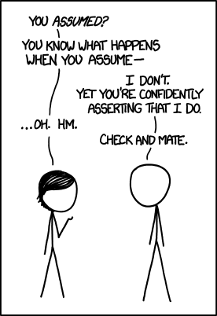
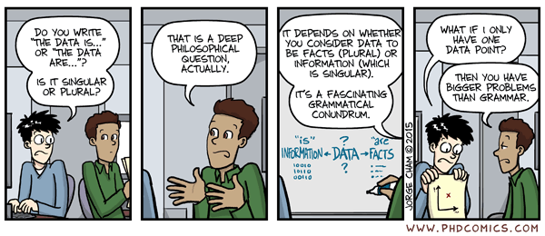
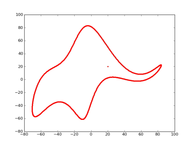

## Model uses

```{r modelusefig,  echo=FALSE, fig.cap='', out.width = '90%', fig.align='center'}
knitr::include_graphics("../media/nri_review_fig1.png")
```


# Model-aided exploration and hypothesis generation


## Model Exploration example
* Question: How dose the antigen dose for a killed (influenza) vaccine affect antibody levels post vaccination? 
* Approach: Build a simple model and explore (after [Handel et al 2018 PCB](https://journals.plos.org/ploscompbiol/article?id=10.1371/journal.pcbi.1006505)).

$$
\begin{aligned}
\dot V &=  - d_V V  - k_A AV \\
\dot F &= p_F - d_F F + \frac{V}{V+ h_V}g_F(F_{max}-F)  \\ 
\dot B & = \frac{F V}{F V + h_F} g_B B \\
\dot A & = r_A B - d_A A - k_A A V
\end{aligned}
$$
(This is a simpler version of the virus and immune response DSAIRM model.)

## Model Exploration example
Run model for different antigen doses ($V_0$).

```{r inoc1,  fig.cap='',  echo=FALSE, out.width = "90%", fig.align='center'}

```


## Model Exploration 
* Looking at the dynamics (time-series) of a model can be useful.
* Often, we are not mainly interested in the time series, but instead some more specific quantity, e.g. total number of infected/pathogens, steady state values, etc.
* We usually want to to know how such outcome(s) of interest vary with some parameter(s).
* For our example, we want to know how antibody levels vary with vaccine dose, and how that affects protection from infection.
* What do we need to do to answer that question?


## Model Exploration  
1. Choose some parameter values.
2. Run the simulation model.
3. Record quantities/outcomes of interest.
4. Choose another set of parameter values (usually we only vary one at a time).
5. Repeat steps 2-4 until you got all parameter-outcome pairs of interest.
6. Report (e.g. plot) your findings.


## Model Exploration  

<div style="float: left; width: 50%;">
* Run model for different $V_0$, record antibodies $A$ at end of each simulation for each $V_0$.
* Use this equation to compute protection as a function of antibody level.
$P= 1 - \frac{1}{e^{k_1(\log(A)-k_2)}}$
</div>

<div style="float: right; width: 50%;">
```{r inoc2,  fig.cap='',  echo=FALSE, out.width = "100%", fig.align='center'}

```
</div>


## Model Exploration - Example 2

Virus fitness as function of virion binding ( $k_+$ ) and release ( $k_-$ ) rates. [Handel et al (2014) Proc Royal Soc Interface](http://rsif.royalsocietypublishing.org/content/11/92/20131083).

```{r stickiness,  echo=FALSE, out.width="80%", fig.align='center'}
knitr::include_graphics("../media/stickiness.png")
```


## Exploration - summary
* If the system/question is very simple, we might not need a model.
* Interactions among pathogens and the immune response are often complex. If we know little about our system and its behavior, building and exploring simple models is often a useful first step.

## Exploration - practice
* We could do the model exploration by hand through the DSAIRM GUI. 
* We could automate it by writing R code that loops over parameters and repeatedly calls the underlying model (see e.g. 'Level 2' in the package tutorial).
* The _Model Exploration_ apps allows you to do such exploration graphically.


# Model-based predictions


## Model-based predictions

```{r modelusefig33,  echo=FALSE, fig.cap='', out.width = '90%', fig.align='center'}
knitr::include_graphics("../media/nri_review_fig1.png")
```


## Model Predictions/Virtual Experiments
* We saw how we can use models to explore how outcomes of interest change with parameters.
* Model exploration is often useful to gain general insights into a system early on.
* Once we built up our understanding and have a model that we think approximates reality reasonably well, we can potentially move on to making predictions and explore 'what-if' scenarios (virtual experiments).

## Prediction types
* Predictions can be of different types:
  * __Qualitative:__ Try to predict shape/direction of an outcome (similar to the 'exploration' model use).
  * __Semi-quantitative:__ Try to predict the approximate or relative size of an outcome.
  * __Quantitative:__ Try to predict (with confidence intervals) the magnitude of an outcome.

```{r dilbertprediction, echo=FALSE, fig.cap='dilbert.com', fig.align='center'}
knitr::include_graphics("../media/dilbert_flupandemic.gif")
```


## Prediction example 

Assume we think this model is a good approximation for a real system we are interested in.
We want to predict the peak burden of bacteria if we were able to increase the induction of the immune response (parameter $r$), e.g. by giving a drug.

$$
\begin{aligned}
\dot{B} & = g B(1-\frac{B}{B_{max}}) - d_B B - kBI\\
\dot{I} & = r BI - d_I I
\end{aligned}
$$


## Prediction example 
We'll follow the same approach as for model exploration, the difference is that now we interpret the results as actual predictions instead of suggested findings that need to be further explored.

```{r nri4,  echo=FALSE, out.width="80%", fig.align='center'}
knitr::include_graphics("../media/nri_review_fig4a.png")
```


## Prediction example 2
```{r fluexample,  echo=FALSE, out.width="80%", fig.align='center'}
knitr::include_graphics("../media/tbkirschner.png")
```
Prediction of TB infection outcomes for depletion of certain cytokines.  [Wigginton and Kirschner (2001) J Immunology](http://www.jimmunol.org/content/166/3/1951).


## Prediction - comments
* Simple models are best for qualitative and semi-quantitative predictions. 
  * If we increase vaccination, does incidence/prevalence drop faster or slower than linear? 
  * As we increase drug dose, how does it affect pathogen load?
* If we want to make precise and detailed predictions, we generally need very detailed (complex) models. 
  * Detailed models are 'data hungry' and often the data are not available.
  * Detailed models are difficult to write and analyze. 


## Prediction - comments

<div style="float: left; width: 50%;">
__All models makes simplifying assumptions. Thus, predictions are only reliable if the underlying model is a good approximation of the real system.__
</div>

<div style="float: right; width: 50%;">
```{r assumption, echo=FALSE, fig.cap='xkcd.com', out.width="90%", fig.align='center'}

```
</div>


## Prediction - practice
* The _Antiviral treatment_ DSAIRM app allows you to make predictions regarding the impact of drug treatment.


# Model fitting

## Model fitting
* We build models based on what we assume/know goes on in a specific system.
* We can use models to explore and make predictions.
* At some point, we need to bring our model results in contact with data to see how our model performs.
* Ideally, the whole process is iterative.  

```{r modelusefig5,  echo=FALSE, fig.cap='', out.width = '60%', fig.align='center'}
knitr::include_graphics("../media/nri_review_fig1.png")
```


## Model testing/validation
The process of going from models to data happens in all of science, often without the explicit use of mathematical models: 

1. make assumptions about system (i.e. a **conceptual model**)
2. generate hypotheses/predictions based on conceptual model
3. collect data (e.g. experiment)
4. compare hypotheses/predictions to data 
5. repeat

```{r experiments,  echo=FALSE, fig.cap='', out.width = '70%', fig.align='center'}

```


## Hypothesis testing with non-mechanistic models
* We usually test hypotheses by collecting data and performing statistical tests to see if there is a pattern (H1) or not (H0). 
* The statistical tests can discriminate between no pattern and some kind of pattern/correlation. 
* If data was collected properly, one can often conclude that there is a causal link. But one can't say much about the mechanisms leading to the observed patterns. 


## Hypothesis testing with mechanistic models
* With mechanistic simulation models, we can directly __test hypotheses/mechanisms:__ We can formulate different models, each representing a set of hypotheses/mechanisms. The quality of fit of each model to the date lends support to specific models/mechanisms.
* The mechanism(s) of the best fitting model are more likely to be correct than those of the less good fitting models.


## Model fitting example 
* Investigate the mechanism of drug action of neuraminidase inhibitors against influenza.

* The Question: What is the mechanism of action of neuraminidase inhibitors, is it reducing virus production of infected cells or infection of uninfected cells? 

* The approach: build models for each mechanism/hypothesis, fit to data and evaluate.

```{r flushots,  fig.cap='dilbert.com',  echo=FALSE, out.width = "90%" , fig.align='center'}

```


## Model/Hypothesis 1

Neuraminidase reduces infection rate of uninfected cells.

$$
\begin{aligned}
\dot{U} & =  - b{\bf(1-f)}UV \\
\dot{I} & =  b{\bf(1-f)}UV - d_I I \\     
\dot{V} & =  pI - d_V V -  gb{\bf(1-f)} UV \\
\end{aligned}
$$

## Model/Hypothesis 2

Neuraminidase reduces rate of virus production by infected cells.

$$
\begin{aligned}
\dot{U} & =  - bUV \\
\dot{I} & =  bUV - d_I I \\     
\dot{V} & =  p{\bf (1-e)}I - d_V V -  gb UV \\
\end{aligned}
$$


## Model fits

```{r flufit,  fig.cap='',  echo=FALSE, out.width = "75%" , fig.align='center'}
knitr::include_graphics("../media/nri_review_fig4b.png")
```


## Parameter estimates
* By fitting models, we can also __estimate biologically meaningful parameters.__ 
* The parameters in our models often represent important biological quantities, fitting returns estimates for the parameter values.
* For the example, the best-fit estimate e=0.98 means the drug reduces virus production by 98%.

$$
\begin{aligned}
\dot{U} & =  - bUV \\
\dot{I} & =  bUV - d_I I \\     
\dot{V} & =  p{\bf (1-e)}I - d_V V -  gb UV \\
\end{aligned}
$$

## Parameter estimates
* One can estimate parameters using just a single model. This allows one to test some mechanisms, e.g. we could use one of the models we just looked at and ask if the drug has an effect (e>0) or not ($e\approx 0$). Fitting a single model and looking at the value of $e$ could answer this. 
* To test more complex hypotheses/mechanisms, one often needs several distinct models. If one of the tested models is deemed a good approximation of the real system, the estimates for its parameters can be consider meaningful.


## Fitting comments
* Fitting mechanistic models is conceptually the same as fitting regression models, but technically more challenging.
* If a non-mechanistic model doesn't fit well, we mainly just learned that we need a better model.
* If a mechanistic model that was built based on our best knowledge doesn't fit well, we have learned something useful!


## Fitting comments

<div style="float: left; width: 50%;">
* If a model is _best_ among a group of models, it can still be _bad_.
* Complex models with many parameters can provide good fits for spurious reasons. 
* It is important to keep models simple to prevent overfitting.
</div>

<div style="float: right; width: 50%;">
_With four parameters I can fit an elephant, and with five I can make him wiggle his trunk._

John von Neumann

```{r elephant,  fig.cap='https://bit.ly/31UB3v9',  echo=FALSE, out.width = "100%" , fig.align='center'}

```
</div>


## Fitting - practice
* The _Influenza Drug model_ in DSAIRM shows the example we just went through. It doesn't go into details of fitting.
* The apps in the _Model fitting_ section of DSAIRM teach some concepts of model fitting.


## Model uses - summary
* 'Data-free' simulation models allow exploration and prediction.
* Hypothesis/mechanism testing and parameter estimation are possible if models are combined with data.
* A project often uses models for several of the described approaches.

```{r modelusefig6,  echo=FALSE, fig.cap='', out.width = '60%', fig.align='center'}
knitr::include_graphics("../media/nri_review_fig1.png")
```


## Literature 
* Joshua Epstein, "Why model", http://jasss.soc.surrey.ac.uk/11/4/12.html
* Rob May, "Uses and Abuses of Mathematics in Biology", doi:10.1126/science.1094442
* Fred Brauer, "Mathematical epidemiology is not an oxymoron", doi:10.1186/1471-2458-9-S1-S2
* Garnett et al, "Mathematical models in the evaluation of health programmes", doi:10.1016/S0140-6736(10)61505-X 


