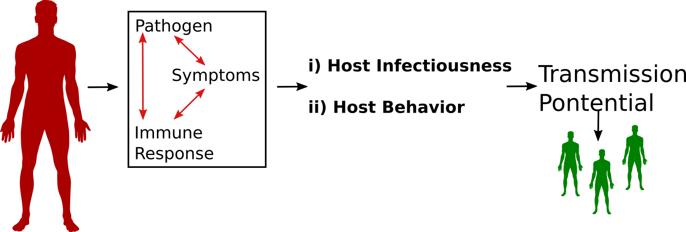
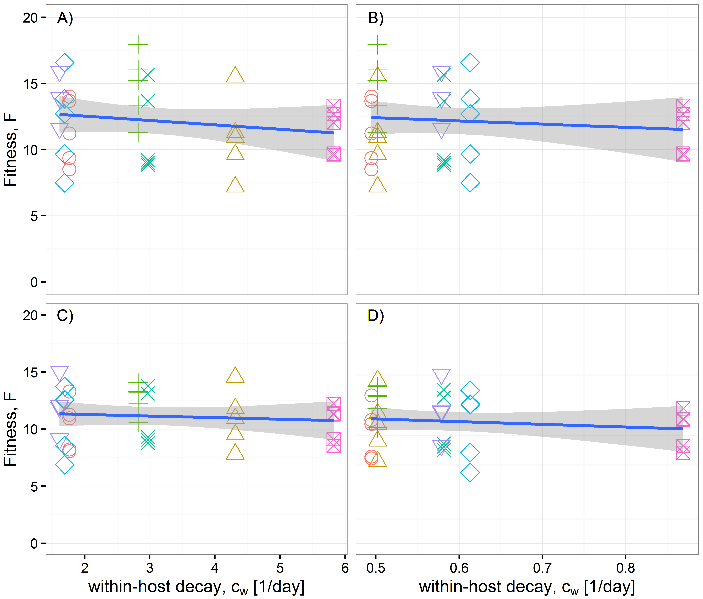
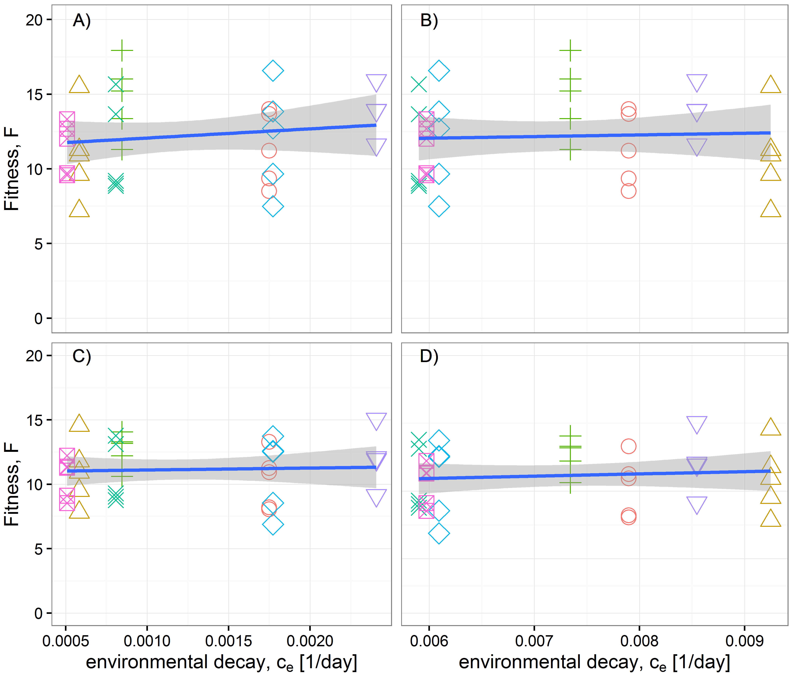
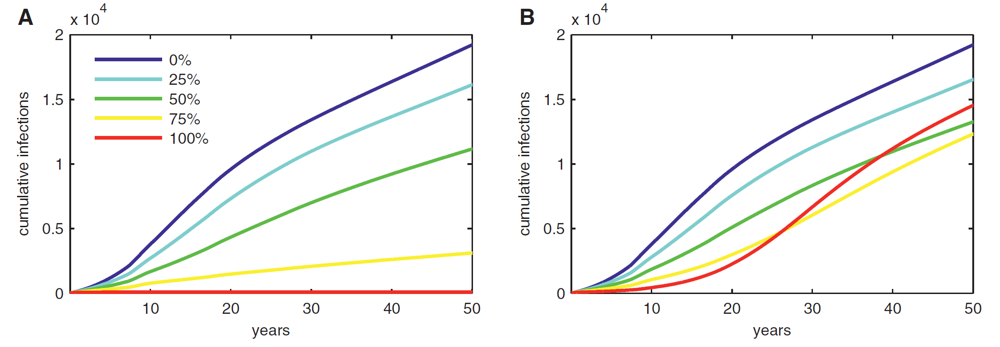
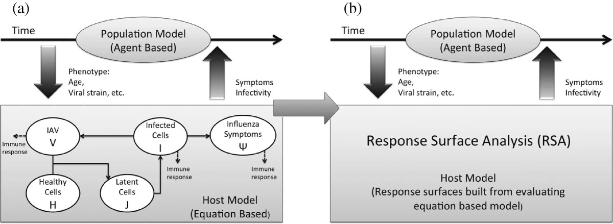

## Introduction 
* Infectious diseases operate on different temporal and spatial scales. 
* Building models that connect scales can allow one to answer new questions.


```{r modelusefig6,  echo=FALSE, fig.cap='', out.width = '90%', fig.align='center'}

```


## Ways to model interactions across scales
* Static: A within-host model is analyzed/simulated. Results are being fed into a between-host model, which is subsequently being run.
* Dynamic: A within-host model is being simulated inside a between-host model. Requires an ABM for the between-host model, each agent has its own infection model running.


## Simple example model
It is easiest to discuss multi-scale models in the context of an example. Let's consider spread of an acute viral infection (e.g. influenza) at the within-host and the population level. 

## Within-host model
At the within host level, we can start with the basic virus model.

$$
\begin{aligned}
\dot{U} & =  n - d_UU - bUV \\
\dot{I} & =  bUV - d_I I \\     
\dot{V} & =  pI - d_V V -  gb UV \\
\end{aligned}
$$

## Between-host model
* At the population level, we'll look at the standard SIR model, with compartments being susceptible, infected and infectious, and recovered. 
* To avoid confusion, we give all the parameters on the population level model Greek letters.

$$
\begin{aligned}
\dot S & = \nu - \beta SI - \mu S  \\ 
\dot I & = \beta S I - \gamma I - \mu I \\
\dot R & = \gamma I  - \mu R  \\
\end{aligned}
$$


## Linking models
* Assume transmission rate is linked to virus load, e.g. $\beta = kV$, with $k$ some parameter.

$$
\begin{aligned}
\dot S & = \nu - {\bf kV} SI - \mu S  \\ 
\dot I & = {\bf kV} S I - \gamma I - \mu I \\
\dot R & = \gamma I  - \mu R  \\
\end{aligned}
$$

Now the between-host model is connected to the within-host model through the variable $V$. 


## Computing virus load
* For a chronic infection model, we can compute $V$ at steady state as function of model parameters. $$V = \frac{n(p-d_Ig)}{d_Id_V}-\frac{d_U}{b}$$ 
* Changes in the within-host parameters now impact the between-host dynamics.
* A similar model could be made that computes total virus load for an acute infection, and assumes this to be proportional to $\beta$ [@handel13].

## Another way to link models
* We could also assume that the duration of the infectious period, $1/\gamma$ is determined by the time $V$ in the within host model drops below a certain level.
* To investigate this:
  - Set within-host model parameters. Run model. Determine time at which $V<1$ from time-series. 
  - Use that time as $1/\gamma$ in the between-host model.
* This approach could be done static (compartmental), or dynamic (ABM).

## Using the linked models to answer a question 
* We could now answer questions such as: Does increased virus infection (parameter $b$) lead to more spread on the population level? If we assume link through $\beta$ and/or $\gamma$.
* For a chronic infection, we can see it from the equation: $$V = \frac{n(p-d_Ig)}{d_Id_V}-\frac{d_U}{b}$$ 
* For an acute infection, we would need to run simulations.


## Closing the loop
* So far, we assumed that the lower scale (within-host) affects the higher scale (between-host).
* One could also consider the population level dynamics to impact the within-host level. E.g. if we had a new (flu) strain spreading on the population level which can partially avoid pre-existing immunity, it might impact the within-host dynamics.
* It gets complicated. One either needs to break down the pieces and look at them individually, or put them all in one large simulation.


## Example 1
Does low-temperature environmental persistence versus high-temperature within-host persistence pose a potential trade-off for avian influenza [@handel13; @handel14]?

Connect a within-host model and a population level model. Explore how different decay rates at different temperatures affect overall virus fitness.

```{r aivfig,  echo=FALSE, fig.cap='', fig.show = "hold", out.width = "45%", fig.align = "default"}


```


## Example 2
How does drug resistance emergence within an HIV infected individual impact the population level dynamics [@saenz2013]?

* Virus infection within-host model with drug sensitive and resistant strain and drug treatment.
* The epi model parameters for infection duration and transmission rate are linked to virus load.


```{r saenzfig,  echo=FALSE, fig.cap='Infected cases for different levels of treatment (color) and without (left) and with (right) within-host drug resistance.', fig.align = "center", out.width = "70%"}

```


## Example 3
A fully dynamic multi-scale model for influenza [@lukens2014].

```{r lukensfig,  echo=FALSE, fig.cap='', fig.align = "center"}

```


## Further reading 
These review papers can provide a good further introduction to the topic:
[@childs2019; @garira2017; @mideo2008a; @murillo13; @handel15]


## References {#verysmall}

