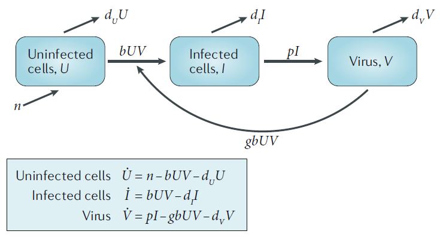
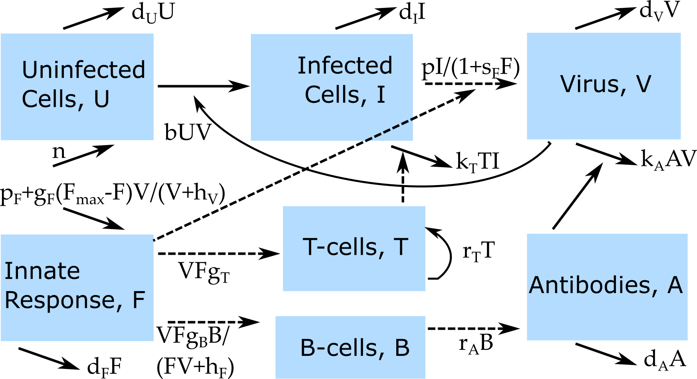

## A simple simulation model
* We'll start with a very simple model, a population of entities (pathogens/immune cells/humans/animals) that grow or die.
* We'll implement the model as a discrete time equation, given by:

$$
P_{t+dt} = P_t + dt ( g P_t - d_P P_t )
$$

* $P_t$ are the number of pathogens in the population at current time $t$, $dt$ is some time step and $P_{t+dt}$ is the number of pathogens in the future after that time step has been taken.
* The processes/mechanisms modeled are growth at rate $g$ and death at rate $d_P$.


## A simple simulation model
* If we started with 100 individuals (pathogens) at time t=0, had a growth rate of 12 and death rate of 2 (per some time unit, e.g. days or weeks or years), and took time steps of $dt=1$, how many individual would we have after 1,2,3... time units?
* Why do we multiply by the time step, _dt_?

$$
P_{t+dt} = P_t + dt ( g P_t - d_P P_t )
$$

## A simple simulation model - variant 1
Original:

$$
P_{t+dt} = P_t + dt ( g P_t - d_P P_t )
$$
Alternative:

$$
P_{t+dt} = P_t + dt ( g - d_P P_t )
$$
What's the difference? Is this a good model?


## A simple simulation model - variant 2
Original:

$$
P_{t+dt} = P_t + dt ( g P_t - d_P P_t )
$$
Alternative:

$$
P_{t+dt} = P_t + dt ( g P_t - d_P)
$$

What's the difference? Is this a good model?

## Discrete time models

$$
P_{t+dt} = P_t + dt ( g P_t - d_P P_t )
$$

* The model above is updated in discrete time steps (to be chosen by the modeler).
* Good for systems where there is a "natural"" time step. E.g. some animals always give birth in spring or some bacteria divide at specific times.
* Used in complex individual based models for computational reasons.
* For compartmental models where we track the total populations (instead of individuals), continuous-time models are more common. They are usually formulated as ordinary differential equations (ODE).
* If the time-step becomes small, a discrete-time model approaches a continuous-time model.


## Continuous time models

Discrete:

$$
P_{t+dt} = P_t + dt ( g P_t - d_P P_t )
$$
Re-write:

$$
\frac{P_{t+dt} - P_t}{dt} =  g P_t - d_P P_t 
$$

Continuous:
$$
\frac{dP}{dt}  = gP - d_P P
$$

* If we simulate a continuous time model, the computer uses a smart discrete time-step approximation.

## Some notation
The following are 3 equivalent ways of writing the differential equation:

$$
\begin{aligned}
\frac{dP(t)}{dt}  &= gP(t) - d_P P(t) \\
\frac{dP}{dt}  &= gP - d_P P \\
\dot{P}  &= gP - d_P P \\
\end{aligned}
$$
We will use the 'dot notation'.


## Some terminology

$$
\dot{P}  = gP - d_P P
$$

* The left side is the instantaneous change in time of the indicated variable.
* Each term on the right side represents a (often simplified/abstracted) biological process/mechanism.
* Any positive term on the right side is an inflow and leads to an increase of the indicated variable.
* Any negative term on the right side is an outflow and leads to a decrease of the indicated variable.


## Extending the model 

$$
\dot{P}  = gP - d_P P
$$

For different values of the parameters _g_ and $d_P$, what broad types of dynamics/outcomes can we get from this model?  


## Extending the model 

$$
\dot{P}  = gP - d_P P
$$

How can we extend the model to get growth that levels off as we reach some high level of _P_?


## Model with saturating growth 
$$
\dot{P}  = gP(1-\frac{P}{P_{max}}) - d_P P
$$

* We changed the birth process from exponential/unlimited growth to saturating growth. $P_{max}$ is the level of $P$ at which the growth term is zero. 
* If $P > P_{max}$, the growth term is negative. 
* The population settles down at a level where the growth balances the decay, i.e. when $gP(1-\frac{P}{P_{max}}) = d_P P$.

## Adding a second variable

* A single variable model is 'boring'.
* The interesting stuff happens if we have multiple compartments/variables that interact.
* Let's introduce a second variable.
* Let's assume that _P_ is a population of some bacteria (but could also be some animal), which gets attacked and consumed by some predator, e.g. the immune system or another animal. We'll pick the letter _H_ for the predator (any label is fine). 


## Adding a second variable
$$
\begin{aligned}
\dot{P} & = gP(1-\frac{P}{P_{max}}) - d_P P \ \pm \ ?\\
\dot{H} & = ?
\end{aligned}
$$

* The predator attacks/eats the prey. What process could we add to the _P_-equation to describe this?

## Adding a second variable
$$
\begin{aligned}
\dot{P} & = gP(1-\frac{P}{P_{max}}) - d_P P - kPH\\
\dot{H} & = ?
\end{aligned}
$$

* The more _P_ there is, the more the predator will grow, e.g. by eating _P_ or by receiving growth signals. 
* What term could we write down for the growth dynamics of _H_?
* Finally, _H_ individuals have some life-span after which they die. How can we model this?

## Predator-prey model

The model we just built is a version of the well-studied predator-prey model from ecology.
$$
\begin{aligned}
\dot{P} & = g_P P(1-\frac{P}{P_{max}}) - d_P P - kPH\\
\dot{H} & = g_H P H - d_H H
\end{aligned}
$$

The discrete-time version of the model is:
$$
\begin{aligned}
P_{t+dt} & = P_t + dt(g_P P_t(1-\frac{P_t}{P_{max}}) - d_P P_t - kP_tH_t)\\
H_{t+dt} & = H_t + dt( g_H P_t H_t - d_H H_t)
\end{aligned}
$$


## Bacteria and immune response model

The names of the variables and parameters are arbitrary. If we think of bacteria and the immune response, we might name them _B_ and _I_ instead.

$$
\begin{aligned}
\dot{B} & = g B(1-\frac{B}{B_{max}}) - d_B B - kBI\\
\dot{I} & = r BI - d_I I
\end{aligned}
$$
$$
\begin{aligned}
B_{t+dt} & = B_t + dt(g B_t(1-\frac{B_t}{B_{max}}) - d_B B_t - k B_t I_t)\\
I_{t+dt} & = I_t + dt( r B_t I_t - d_I I_t)
\end{aligned}
$$


## Graphical model representation

* It is important to go back and forth between words, diagrams, equations.
* Diagrams specify a model somewhat, but not completely. The diagram below could be implemented as ODEs or discrete time or stochastic models.

```{r bacteriadiagram,  fig.cap='',  echo=FALSE, out.width = "80%", fig.align='center'}
knitr::include_graphics("../media/nri_review_fig3a.png")
```


## Model exploration
<div style="float: left; width: 50%;">
* We could analyze the model behavior with 'pencil and paper' (or some software, e.g. Mathematica/Maxima). This only works for simple models. 
* We could analyze the model behavior by simulating it.
* To simulate, we need to implement the model on a computer, specify starting (initial) conditions for all variables and values for all model parameters.
</div>

<div style="float: right; width: 50%;">
```{r nribacteria,  out.width = '100%', echo=FALSE, fig.align='center'}
knitr::include_graphics("../media/nri_review_fig3.png")
```
</div>


# A simple virus infection model


## A simple virus infection model

```{r nrivirus,  out.width = '100%', echo=FALSE, fig.align='center'}

```


## A simple virus infection model

```{r nrivirus2,  out.width = '70%', echo=FALSE, fig.align='center'}
knitr::include_graphics("../media/nri_review_fig2.png")
```


## Notation comment
* If you read the literature, you'll see all kinds of letters used for variables and parameters. That can be confusing but unfortunately unavoidable. 
* Look carefully at models and see how variables/parameters are defined. A model that looks new might in fact be one that you know, just using different notation.
* These 2 models are the same as the model we just saw!

$$
\begin{aligned}
\dot{T} &= s - kT -  \beta T V \\
\dot{T^*}&  =  \beta T V - d T^* \\
\dot{V} & =  nT^* - c V -  \beta g TV \\
\end{aligned}
$$
$$
\begin{aligned}
\dot{x} & = \lambda - dx - \beta x v \\
\dot{y} & =  \beta x v - a y \\
\dot{v} & =  \kappa y - u v -  \beta g xv \\
\end{aligned}
$$


# A larger virus infection model


## Virus and Immune Response Model
* The immune response is incredibly complex, we still don't know how to model it in much detail.
* We can nevertheless build and explore models that are a (hopefully) good balance between realism and abstraction.
* Let's look at a virus model that contains uninfected cells (**U**), infected cells (**I**), virus (**V**),  an innate immune response (**F**), CD8 T-cells (**T**), B-cells (**B**) and Antibodies (**A**).


## Model Diagram
```{r VirusIR,  echo=FALSE, out.width="90%", fig.align='center'}

```


## Model Equations

$$
\begin{aligned}
\dot U &= n - d_U U - bUV\\ 
\dot I &= bUV - d_I I - k_T T I\\
\dot V &= \frac{pI}{1+s_F F} - d_V V - b UV - k_A AV \\
\dot F &= p_F - d_F F + \frac{V}{V+ h_V}g_F(F_{max}-F)  \\ 
\dot T &= F V g_T + r_T T\\
\dot B & = \frac{F V}{F V + h_F} g_B B \\
\dot A & = r_A B - d_A A - k_A A V
\end{aligned}
$$


## Learn more

DSAIRM package:

* _Basic Bacteria Model_ app.
* _Basic Virus Model_ app. 
* _Virus and Immune Response_ app.


