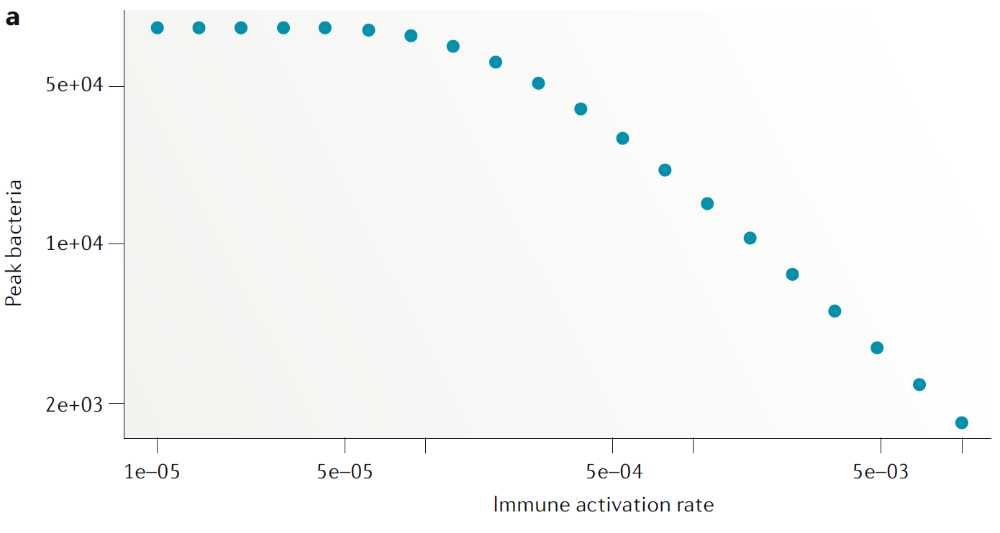
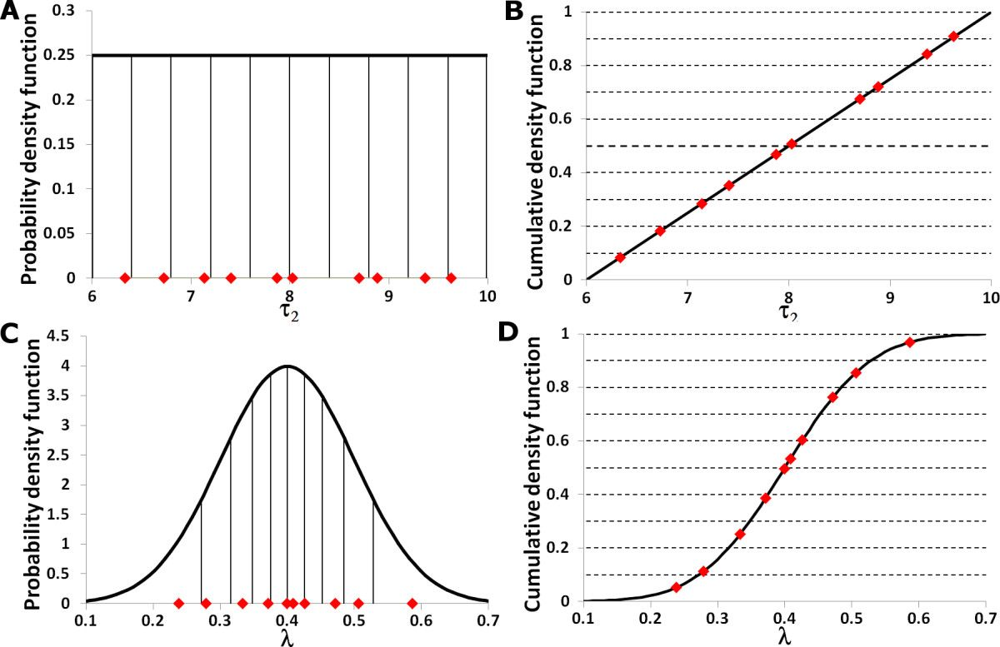

## Uncertainty in model results

* Model results have different sources of uncertainty attached to them.
* Not all types of uncertainty are always explicitly acknowledged. 
* That's true not only for mathematical/computer models.

## Structural Uncertainty
* Models are simplifications and abstractions of the real world.
* Specific assumptions lead to different models.
* Every model is 'wrong' in some sense, but some might be useful.
* We need to decide which variables and processes to include and which to exclude.

```{r mapfigure, echo=FALSE, fig.cap="", out.width="90%", fig.align='center'}
knitr::include_graphics("../media/nri_review_modeldetail.png")
```


## Structural Uncertainty
* Include certain variables/components not? 
* How to formulate mechanisms/processes?
* What type of model? (ODE, IBM, etc.)


## Example variants of specific processes
Exponential or Linear growth? 
Mass-action or saturating killing?

$$
\begin{aligned}
\dot{B} & = g B - d_B B - kBI\\
\dot{I} & = r BI - d_I I \\
\\
\dot{B} & = g  - d_B B - k\frac{B}{B+s}I\\
\dot{I} & = r BI - d_I I \\
\end{aligned}
$$


## Structural Uncertainty Example 
Dobrovolny et al. (2013 PLoS One) compared different influenza models and assessed how they matched experimental data.

```{r dobrovolny, echo=FALSE, fig.cap='Top: models, bottom: data', out.width = '100%', fig.align='center'}
knitr::include_graphics("../media/dobrovolny.png")
```


## Structural Uncertainty - Summary
* The biggest source of variability in outcomes.
* No systematic way to deal with it.
* Often discussed/addressed the least. Comparison of results across models is rare.
* Topical example: https://www.cdc.gov/coronavirus/2019-ncov/covid-data/forecasting-us.html

## Structural Uncertainty - Practice

* The _Model variant exploration_ app in DSAIRM explores the impact of different model formulations.


# Parameter Uncertainty


## Parameter Uncertainty
* Assume we chose a certain structure for our model and built it (e.g. a certain set of ordinary differential equations).
* To explore the model or make predictions, we need to supply it with values for the model parameters (and starting conditions).
* Often, we do not know the values for the model parameters very well.

$$
\begin{aligned}
\dot{B} & = g B - d_B B - kBI\\
\dot{I} & = r BI - d_I I \\
\end{aligned}
$$

## Exploring the impact of model parameters 
* Sometimes we can obtain estimates for parameter values from fitting to data, but the right data is often not available.
* Instead of running our model for just one set of parameter values, we could run it using different values that are within reasonable ranges.
* If we have a small model, we could systematically explore model behavior for each parameter.

```{r modelexploration,  echo=FALSE, out.width="55%", fig.align='center'}

```


## Exploring the impact of model parameters 
* Once models get big, it would take too long to thoroughly scan over all parameters.
* Often we can get reasonable ranges from the literature, but not exact values.
* Sometimes, we might be _mainly_ interested in how results change as we vary one parameter, but we also want to know how uncertainty in other parameters affect our outcome.
* Other times, we might want to use our model to make predictions. We need to figure out how uncertainty in parameters affects our predictions. 

## Uncertainty & Sensitivity Analysis
Varying multiple inputs/parameters over a usually broad range is called a (global) uncertainty & sensitivity analysis.

* __Uncertainty Analysis:__ Given uncertainty in the inputs (parameters), how much uncertainty is there in the outputs/results?
* __Sensitivity Analysis:__ How much do individual inputs contribute to the uncertainty in outputs/results? 


## Doing Uncertainty & Sensitivity Analysis
* Determine ranges of uncertainty for each input (parameter and initial conditions). 
* Repeatedly draw samples of parameter values from the specified distributions.
* Run model for each parameter sample, record outcomes.

## Parameter ranges
For each parameter, specify its distribution:

* Single value if we are very certain.
* Uniform distribution between some min and max values if we know very little.
* A 'peaked' distribution (e.g. gamma, log-normal) if we are fairly certain about some parameters.

```{r paramdist,  echo=FALSE, out.width="50%", fig.align='center', fig.cap='Hoare et al 2008 TBMM'}

```

## Parameter sampling
* Exhaustively trying all parameter value combinations takes too long.
* Randomly sampling is not efficient, it might leave areas of parameter space unexplored.
* A method called Latin Hypercube Sampling creates samples that efficiently span the parameter space.

```{r lhssample,  echo=FALSE, out.width="100%", fig.align='center', fig.cap='Hoare et al 2008 TBMM'}

```

## Uncertainty Analysis
* Sample over parameters, record outcomes for each sample.
* Show the uncertainty in outcomes due to uncertainty in parameters with e.g. a boxplot

```{r uncertainty,  echo=FALSE, out.width="40%", fig.align='center'}
knitr::include_graphics("../media/uncertainty.png")
```

Example of a boxplot for some U/S analysis. For different intervention strategies (along the x-axis), samples are run and some outcome is recorded. 


## Sensitivity Analysis
* Uncertainty analysis tells us how uncertainty in inputs affects uncertainty in outputs.
* If we want to know in more detail how a specific input affects a specific output, we can move on to sensitivity analysis.
* Using the same simulation results, we now plot scatterplots for income/outcome pairs of interest instead of boxplots.

```{r sensitivity,  echo=FALSE, out.width="40%", fig.cap='Handel et al (2009), Epidemics', fig.align='center'}

```

## Sensitivity Analysis
* If the scatterplot shows a monotone relation, we can summarize it with a single number, a correlation coefficient
* Correlation Coefficients (CC) indicate how correlated a given output is with a given input.
* CC are between -1 and 1. Large CC means strong (negative) correlation, CC ≈ 0 means no correlation.
* Input-output relations are often nonlinear, therefore computing the linear correlation is often not the best measure.
* Using a Rank CC is usually more suitable.
* Partial Rank Correlation Coefficients (PRCC) are even better if multiple inputs/parameters are changed at the same time.

## U/S Analysis - Summary
* Uncertainty in parameters can be fairly easily quantified.
* By sampling over parameters, one can obtain confidence intervals or similar measures of uncertainty.
* __This does not account for structural or inherent uncertainty!__


## Parameter uncertainty - Practice
* The _U/S analysis_ app explores the concept in more detail.


# Inherent/Stochastic Uncertainty

## Introduction 
* Deterministic models (both continuous and discrete-time) give you the same result for a set of parameters and starting conditions no matter how often you run them.
* Real systems are stochastic/random, which means they have some inherent variability.
* The words Stochasticity, Randomness, Noise, Variability are often used interchangably.

## Sources of Stochasticity
* Random (external) noise (e.g. measurement error).
* Fluctuations in parameters (e.g. due to temperature or circadian rythms).
* Unpredictability of event occurence (e.g. births, deaths).

## When is stochasticity important
* For small numbers.
* When we want to answer questions such as "What is the probability that X will happen?"

## Stochastic compartmental models
We can fairly easily formulate any compartmental model (e.g. and ODE model) as a stochastic model.

* All variables take on discrete values (0,1,2,...).
* Increases or decreases are dicated by inflows and outflows.
* At each time step, one of the possible inflows/outflows occurs, with probability based on the size of the term.

## Some terminology
* The events that happen are often called reactions or transitions.
* The inflow and outflow terms are called propensities, multiplied by the time step they are probabilities.


## Example 

$$
\begin{aligned}
\textrm{Uninfected Cells} \qquad \dot{U} & = n -d_U U - bUV \\
\textrm{Infected Cells} \qquad \dot{I} & =  bUV - d_I I \\     
\textrm{Virus} \qquad  \dot{V} & =  pI - d_V V -  b UV 
\end{aligned}
$$

Event type              |  Transitions                  |   Propensity      |
----------              |  -----------                  |   ----------      |
Production of U         |  U => U+1                     |   n            |
death/removal of U      |  U => U-1                     |   $d_U$U           |
infection               |  U => U-1, V => V-1, I => I+1 |   bUV           |
death if I              |  I => I-1                     |   $d_I$I          |
production of V         |  V => V+1                     |   pI          |
removal of V            |  V => V-1                     |   $d_V$V          | 


## Comments
* Stochastic models are not much harder to implement, but they require more computational time since we need to run ensembles.
* One can fit stochastic models to data, but that's tricky and takes a long time.
* The `adaptivetau` package in R makes implementing stochastic models easy.
* The `pomp` package in R is a good tool for fitting stochastic models.

## Stochastic uncertainty - Practice
* The apps in the _Stochastic models_ section of DSAIDE provide more details.
* The _Stochastic Model_ and _Influenza antivirals and resistance_ apps in DSAIRM illustrate stochastic models. 

## Summary
* Uncertainty in modeling results can come from different sources.
* Structural uncertainty is arguably the most important but rarely explored. (Similar problems exist outside of modeling, e.g. how good a model are mice or elite undergrad students for the general population?)
* Parameter uncertainty is increasingly included in modeling projects and should be explored if a model is used for prediction.
* Stochastic models are also becoming more common but are still somewhat harder to work with.


