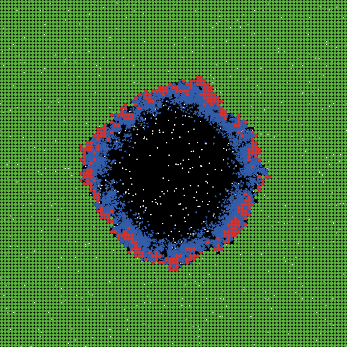

## Introduction

* I assume you watched the 2 lectures, here I'm giving a brief summary and touching on some of the highlights.

* I allocated most of the time for discussion/Q&A.


## Simulation models 

* Are widely used in all areas of science.
* Are implementations of specific processes/mechanisms as a computer model.

$$
\begin{aligned}
\textrm{Bacteria} \qquad \dot{B} & = g B(1-\frac{B}{B_{max}}) - d_B B - kBI\\
\textrm{Immune Response} \qquad \dot{I} & = r BI - d_I I
\end{aligned}
$$

```{r bacteriadiagram,  fig.cap='',  echo=FALSE, out.width = "70%", fig.align='center'}
knitr::include_graphics("../media/nri_review_fig3a.png")
```

## Model type comparison

* __Phenomenological/non-mechanistic/(statistical) models__
  * Look for patterns in data
  * Do not describe mechanisms leading to the observed outcomes (data)
  
$$
y = b_0 + b_1 x_1 + b_2 x_2 + ...
$$  
  

* __Mechanistic/process/simulation models__
  * Try to represent simplified versions of mechanisms
  * Can be used without and with data (and then also become _statistical_)


## Simulation model uses

* Exploring the behavior of a system.
* Making predictions about the behavior of a system.
* (With data) Performing inference, testing hypotheses.

```{r kirschnertb,  echo=FALSE, fig.cap='Exploring/predicting cytokine-based interventions for TB (Wigginton and Kirschner, 2001 J Imm)', out.width = '60%', fig.align='center'}
knitr::include_graphics("../media/tbkirschner.png")
```


## Simulation model types

* Compartmental models are the simplest and most widely used.
```{r,  fig.cap='',  echo=FALSE, out.width = "40%", fig.align='center'}
knitr::include_graphics("../media/nri_review_fig3a.png")
```

* Agent-based or network models are more detailed/complex.
```{r,  fig.cap='Acute virus infection. (Handel et al 2009 J Roy Soc Interface)',  echo=FALSE, out.width = "35%", fig.align='center'}

```


## Discussion, Q&A, AMA

* Type in the chat or unmute and ask.
