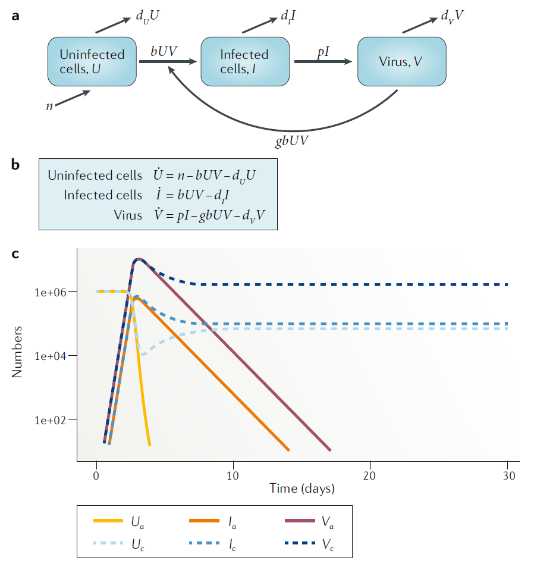
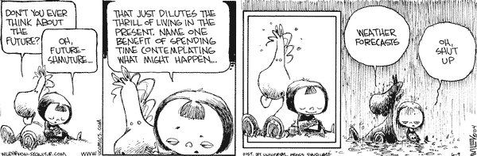

## Science needs data

```{r doingscience,  echo=FALSE, fig.cap='dilbert.com', out.width = '100%', fig.align='center'}

```


## Experimental studies

<div style="float: left; width: 50%;">
* The approach used in almost all bench/lab sciences.
* Clinical trials in Public Health and Medicine.
* Potentially most powerful because we have most control.
* Not always possible.
</div>

<div style="float: right; width: 50%;">
```{r expstudies,  echo=FALSE, fig.cap='', out.width = '80%', fig.align='center'}

```
</div>


## Observational studies

* Widely used in Public Health and other areas (e.g. Medicine, Sociology, Geology).
* Not as powerful as experimental studies.
* Often the only option.

```{r obsstudies,  echo=FALSE, fig.cap='Jim Borgman', out.width = '70%', fig.align='center'}
knitr::include_graphics("../media/studies-produce-random-results.png")
```


## Simulation/modeling studies

* Computer models can represent a real system.
* Simulated data is not as good as real data.
* Often the only option.

```{r modelstudies,  echo=FALSE, fig.cap='xkcd.com', out.width = '100%', fig.align='center'}
knitr::include_graphics("../media/xkcd_algorithm_help.png")
```


## Modeling definition

* The term __modeling__ usually means (in science) the description and analysis of a system using mathematical or computational models. 

```{r modelsketch,  echo=FALSE, fig.cap='', out.width = '70%', fig.align='center'}

```


* Many different types of modeling approaches exist. Simulation models are one type (with many subtypes).

## A way to classify models


* __Phenomenological/non-mechanistic/(statistical) models__
  * Look at patterns in data
  * Do not describe mechanisms leading to the data
* __Mechanistic/process/simulation models__
  * Try to represent simplified versions of mechanisms
  * Can be used with and without data


## Phenomenological models

<div style="float: left; width: 50%;">
* You might be familiar with statistical models (that includes Machine Learning, AI, Deep Learning,...).
* Most of those models are phenomenological/non-mechanistic (and static).
* Those models are used extensively in all areas of science.
* The main goal of these models is to understand data/patterns and make predictions.
</div>

<div style="float: right; width: 50%;">
```{r curvefitting2,  fig.cap="xkcd.com", echo=FALSE, out.width = '80%', fig.align='center'}
knitr::include_graphics("../media/xkcd-curve_fitting.png")
```
</div>


## Non-mechanistic model example

```{r phenomodel1,  fig.cap="Wu et al 2019 Nature Communications.", echo=FALSE, out.width = '70%', fig.align='center'}

```


## Non-mechanistic models - Advantages
* Finding correlations/patterns is (relatively) simple.
* Some models are very good at predicting (e.g. Netflix, Google Translate).
* Sometimes we can go from correlation to causation.
* We don't need to understand all the underlying mechanisms to get actionable insights.

```{r xmkcml,  fig.cap="dilbert.com", echo=FALSE, out.width = '100%', fig.align='center'}
knitr::include_graphics("../media/dilbert-machine-learning.gif")
```


## Non-mechanistic models - Disadvantages

<div style="float: left; width: 50%;">
* The jump from correlation to causation is always tricky (bias/confounding/systematic errors). 
* Even if we can assume a causal relation, we do not gain a lot of mechanistic insights or deep understanding of the system.
</div>

<div style="float: right; width: 50%;">
```{r mldilbert,  fig.cap="xkcd.com", echo=FALSE, out.width = '90%', fig.align='center'}
knitr::include_graphics("../media/xkcd-machine_learning.png")
```
</div>


## Mechanistic models

<div style="float: left; width: 50%;">
* We formulate explicit mechanisms/processes driving the system  dynamics.
* This is done using mathematical equations (often ordinary differential equations), or computer rules.
* Also called __systems/dynamic(al)/ (micro)simulation/process/ mathematical/ODE/... models__.


</div>

<div style="float: right; width: 50%;">
```{r idprocess,  fig.cap="", echo=FALSE, out.width = '90%', fig.align='center'}
knitr::include_graphics("../media/nri_review_fig3.png")
```
</div>


## Mechanistic model example 

<div style="float: left; width: 40%;">

$$
\begin{aligned}
\dot V & = rV-kVT^*\\
\dot P & = fV - dP \\
\dot T & = -aPT \\
\dot T^* & = aPT + gT^*
\end{aligned}
$$
</div>

<div style="float: right; width: 60%;">


```{r predictexample2,  fig.cap='Handel & Antia 2008 J Vir', echo=FALSE, out.width = '100%', fig.align='center'}

```

</div>


## Mechanistic models - Advantages
<div style="float: left; width: 50%;">
* We get a potentially deeper, mechanistic understanding of the system.
* We know exactly how each component affects the others in our model.
</div>

<div style="float: right; width: 50%;">
```{r bacteriafig1,  fig.cap="", echo=FALSE, out.width = '90%', fig.align='center'}
knitr::include_graphics("../media/nri_review_fig3a.png")
```
</div>


## Mechanistic models - Disadvantages
<div style="float: left; width: 50%;">
* We need to know (or assume) something about the mechanisms driving our system to build a mechanistic model.
* If our assumptions/model are wrong, the "insights" we gain from the model are spurious.
</div>

<div style="float: right; width: 50%;">
```{r bacteriafig2,  fig.cap="", echo=FALSE, out.width = '90%', fig.align='center'}
knitr::include_graphics("../media/nri_review_fig3a.png")
```
</div>


## Non-mechanistic vs Mechanistic models 
* Non-mechanistic models (e.g. regression models, machine learning) are useful to see if we can find patterns in our data and possibly predict, without necessarily trying to understand the mechanisms.
* Mechanistic models are useful if we want to study the mechanism(s) by which observed patterns arise.

**Ideally, you want to have both in your 'toolbox'.**    


## Simulation models
* We will focus on __mechanistic simulation models.__
* The hallmark of such models is that they explicitly (generally in a simplified manner) model processes occuring in a system. 


## Simulation modeling uses
* Weather forecasting.
* Simulations of a power plant or other man-made system.
* Predicting the economy.
* Infectious disease transmission.
* Immune response modeling.
* ...

```{r weatherforecast,  echo=FALSE, fig.cap='www.gocomics.com/nonsequitur', out.width = '100%', fig.align='center'}

```


## Real-world examples
Using a TB model to explore/predict cytokine-based interventions (Wigginton and Kirschner, 2001 J Imm).
```{r kirschnertb,  echo=FALSE, fig.cap='', out.width = '80%', fig.align='center'}
knitr::include_graphics("../media/tbkirschner.png")
```


## Real-world examples
Targeted antiviral prophylaxis against an influenza pandemic (Germann et al 2006 PNAS).
```{r iraflu,  echo=FALSE, fig.cap='', out.width = '50%', fig.align='center'}

```


## Within-host and between-host modeling

Within-host/individual level | Between-host/population level |
---------- | ---------- |
Spread inside a host (virology, microbiology, immunology) | Spread on the population level (ecology, epidemiology) |
Populations of pathogens & immune response components | Populations of hosts (humans, animals) |
Acute/Persistent (e.g. Flu/TB) | Epidemic/Endemic (e.g. Flu/TB) |
Usually (but not always) explicit modeling of pathogen | Often, but not always, no explicit modeling of pathogen |

The same types of simulation models are often used on both scales.


## Population level modeling history

* 1766 - Bernoulli "An attempt at a new analysis of the mortality
caused by smallpox and of the advantages of inoculation to
prevent it" (see Bernoulli & Blower 2004 Rev Med Vir)
* 1911 – Ross "The Prevention of Malaria"
* 1920s – Lotka & Volterra "Predator-Prey Models"
* 1926/27 - McKendrick & Kermack "Epidemic/outbreak models"
* 1970s/80s – Anderson & May
* Lot’s of activity since then
* See also Bacaër 2011 "A Short History of Mathematical Population Dynamics"


## Within-host modeling history

* The field of within-host modeling is somewhat recent, with early attempts in the 70s and 80s and a strong increase since then.
* HIV garnered a lot of attention starting in the late 80s, some influential work happened in the early 90s.
* Overall, within-host models are still less advanced compared to between-host modeling, but it's rapidly growing.

