# Why model (infectious diseases)?
* What can we do with models? 
* What questions can they help answer?

```{r whymodel, echo=FALSE, fig.cap='', out.width = '70%', fig.align='center'}
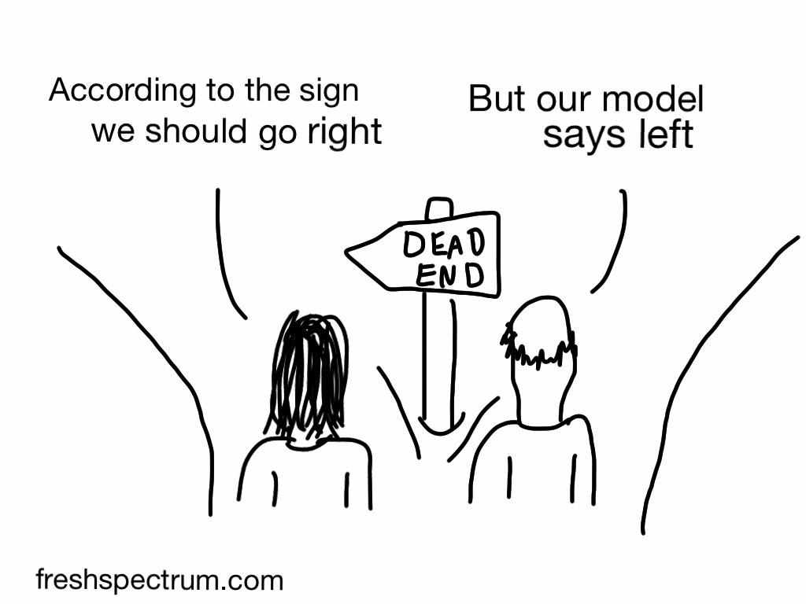
```


---


# Model uses
* __Exploration:__ We can build and analyze models to better understand the complex dynamics of a system and generate hypotheses.
* __Prediction & What-if scenarios:__ We can perform virtual experiments and make predictions.
* __Hypothesis testing & Parameter Estimation:__ We can fit models to data (inference) to test mechanisms/hypotheses and to estimate parameters.


```{r modelusefig,  echo=FALSE, fig.cap='', out.width = '70%', fig.align='center'}
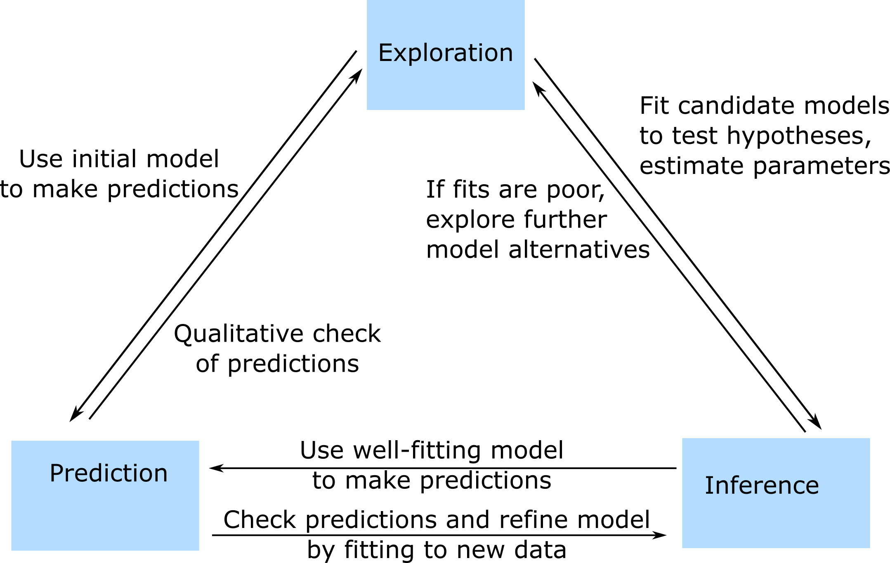
```


---
class: center, middle

# Model-aided exploration and hypothesis generation


---

# Model-aided exploration - an example
* For a single infectious disease outbreak, more intervention/control (through e.g. drugs or social distancing) is generally better.
* If multiple outbreaks are likely and no control is possible beyond the first outbreak (e.g. because of drug resistance or resource limitation) how does the best control strategy change?
* Use a simple model to understand/explore optimal intervention strategies for multi-outbreak settings.
* Details:  Handel et al _"What is the best control strategy for multiple infectious disease outbreaks?"_ Proceedings of the Royal Society B 2007. 


---


# Using a model to answer the question

```{r multioutbreakmodelfigure,  echo=FALSE, fig.cap='', out.width = '80%', fig.align='center'}

```

```{r multioutbreakv2,  echo=FALSE, fig.cap='Basic SIR model with control.', out.width = '80%', fig.align='center'}
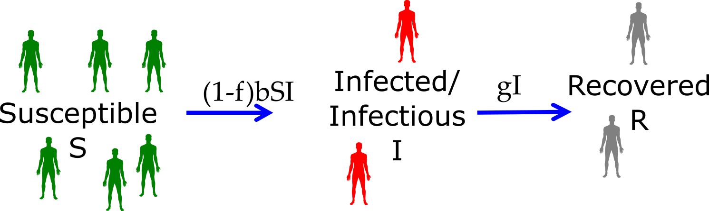
```


$$
\begin{aligned}
\dot S & = -(1-f)bSI \\
\dot I &  = (1-f)bSI - gI \\
\dot R &  = gI \\
\end{aligned}
$$


---


# The overshoot concept


```{r overshootfig,  echo=FALSE, fig.cap='The overshoot concept.', out.width = '90%', fig.align='center'}
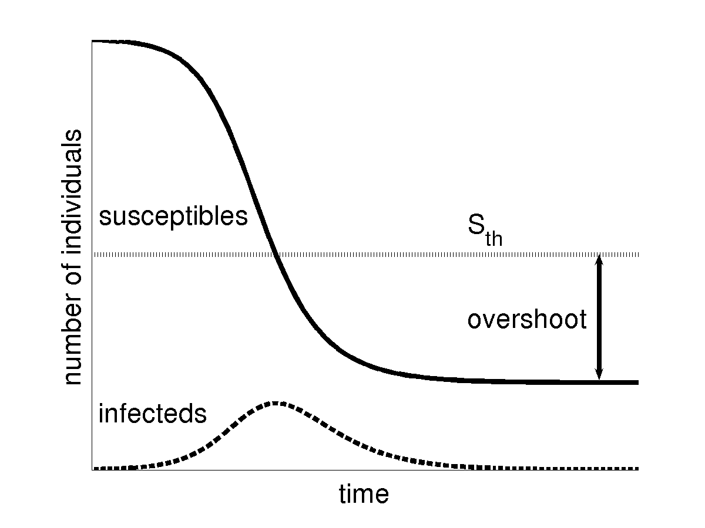
```

---


# Control during multiple outbreaks

```{r multicontrol,  echo=FALSE, fig.cap='Control during multiple outbreaks', out.width = '90%', fig.align='center'}
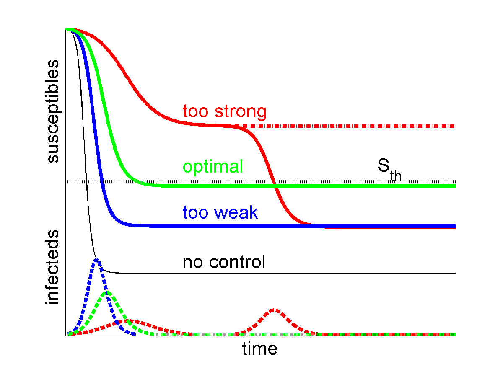
```


---

# Ways to implement optimal control

```{r multicontroltypes,  echo=FALSE, fig.cap='Ways to implement optimal control', out.width = '90%', fig.align='center'}
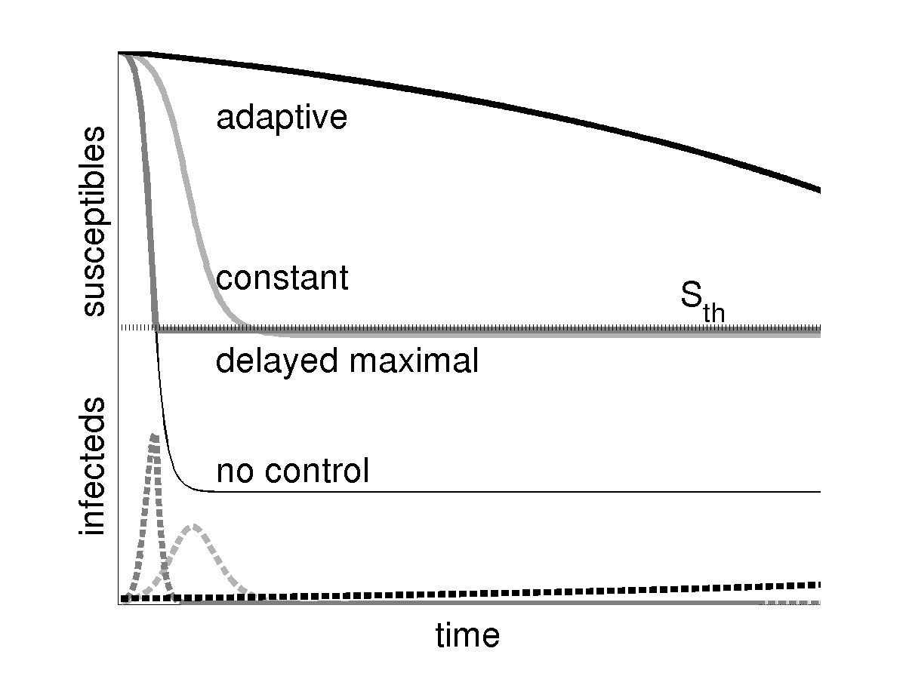
```


---
# Model Exploration - more examples
* Looking at the dynamics (time-series) of a model can be useful.
* Often, we are not mainly interested in the time series, but instead some more specific quantity, e.g. total number of infected/pathogens, steady state values, etc.
* We usually want to to know how such outcome(s) of interest vary with some parameter(s).
* What do we need to do to answer such questions?

.pull-left[

```{r SIRdiagram2,  fig.cap='',  echo=FALSE, out.width = "100%", fig.align='center'}

```
]

.pull-right[

```{r virusdiagram,  out.width = '100%', echo=FALSE, fig.align='center'}
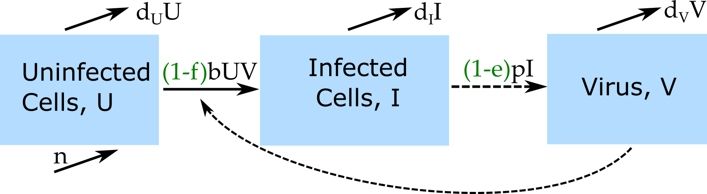
```

]


---
# Model Exploration  
1. Choose some parameter values.
2. Run the simulation model.
3. Record quantities/outcomes of interest.
4. Choose another set of parameter values (usually we only vary one at a time).
5. Repeat steps 2-4 until you got all parameter-outcome pairs of interest.
6. Report (e.g. plot) your findings.

---
# Model Exploration  
.pull-left[
```{r SIRdiagram21,  fig.cap='',  echo=FALSE, out.width = "100%", fig.align='center'}

```

```{r SIRloop,  fig.cap='',  echo=FALSE, out.width = "100%", fig.align='center'}
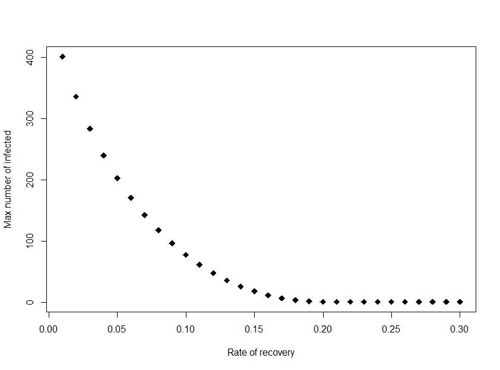
```
]

.pull-right[

```{r virusdiagram12,  out.width = '100%', echo=FALSE, fig.align='center'}

```

```{r predictexample,  fig.cap='', echo=FALSE, out.width = '100%' , fig.align='center'}
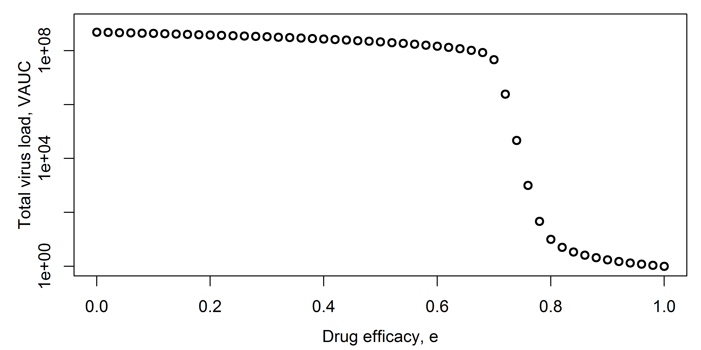
```

]


---
# Model Exploration - Example 2
Persistence of TB in a population as a function of latent activation rate. [Zheng et al (2014) PLoS One.](https://journals.plos.org/plosone/article?id=10.1371/journal.pone.0105721)

```{r tbexample,  echo=FALSE, out.width="50%", fig.align='center'}
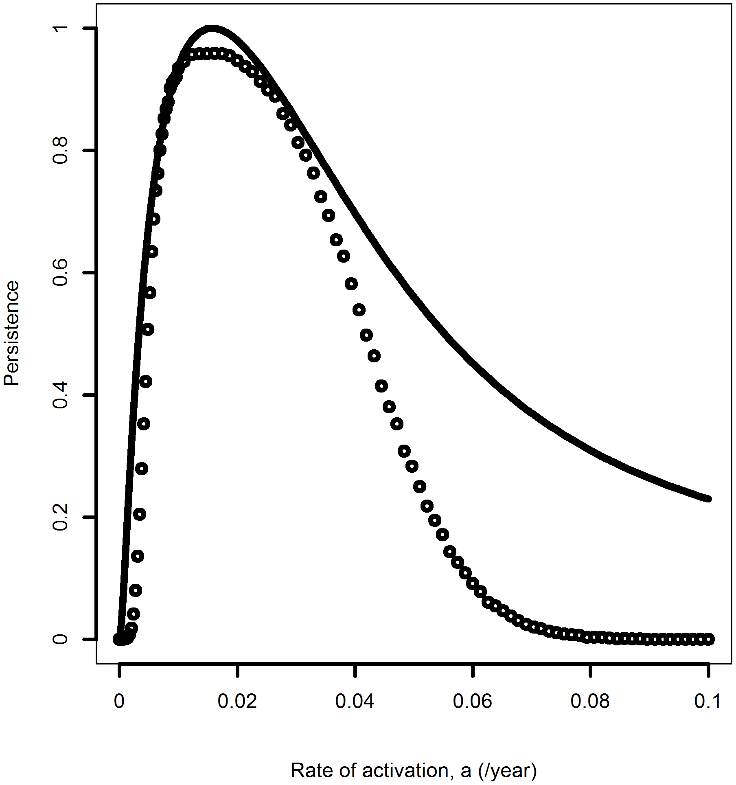
```


---
# Model Exploration - Example 3

Virus fitness as function of virion binding ( $k_+$ ) and release ( $k_-$ ) rates. [Handel et al (2014) Proc Royal Soc Interface](http://rsif.royalsocietypublishing.org/content/11/92/20131083).

```{r stickiness,  echo=FALSE, out.width="80%", fig.align='center'}
knitr::include_graphics("./media/stickiness.png")
```


---
# Exploration - summary
* If the system/question is very simple, we might not need a model (e.g. for a single outbreak, all things equal we know more control is better).
* Infectious disease systems are often complex. If we know little about our system and its behavior, building and exploring simple models is often a useful first step.

---
# Exploration - practice
* We could do the model exploration by hand through the DSAIDE/DSAIRM GUI. 
* We could automate it by writing R code that loops over parameters and repeatedly calls the underlying model (see e.g. 'Level 2' in the package tutorial).
* The _Model Exploration_ app allows you to do such exploration graphically.


---
class: center, middle

# Model-based predictions


---
# Model Predictions/Virtual Experiments
* We saw how we can use models to explore how outcomes of interest change with parameters.
* Model exploration is often useful to gain general insights into a system early on.
* Once we built up our understanding and have a model that we think approximates reality reasonablt well, we can potentially move on to making predictions and explore 'what-if' scenarios (virtual experiments).

---
# Prediction types
* Predictions can be of different types:
  * __Qualitative:__ Try to predict shape/direction of an outcome (similar to the 'exploration' model use).
  * __Semi-quantitative:__ Try to predict the approximate or relative size of an outcome.
  * __Quantitative:__ Try to predict (with confidence intervals) the magnitude of an outcome.

```{r dilbertprediction, echo=FALSE, fig.cap='dilbert.com', fig.align='center'}

```


---


# Semi-quantitative prediction example
* Multi-group effort to use computer models to predict how different interventions affect TB incidence and prevalence in 2025.

```{r tbmacgroups,  echo=FALSE, fig.cap='', out.width = '100%', fig.align='center'}
knitr::include_graphics("./media/TBMAClogos.png")
```

* More details:
  * Houben et al _"Feasibility of achieving the 2025 WHO global tuberculosis targets in South Africa, China, and India: a combined analysis of 11 mathematical models."_ Lancet Global Health, 2016.
  * Menzies et al _"Cost-effectiveness and resource implications of aggressive action on tuberculosis in China, India, and South Africa: a combined analysis of nine models."_ Lancet Global Health, 2016.

---


# UGA model
* Ordinary differential equation (ODE) model with a total of 72 compartments/equations.

```{r tbmacmodel,  echo=FALSE, fig.cap='', out.width = '100%', fig.align='center'}
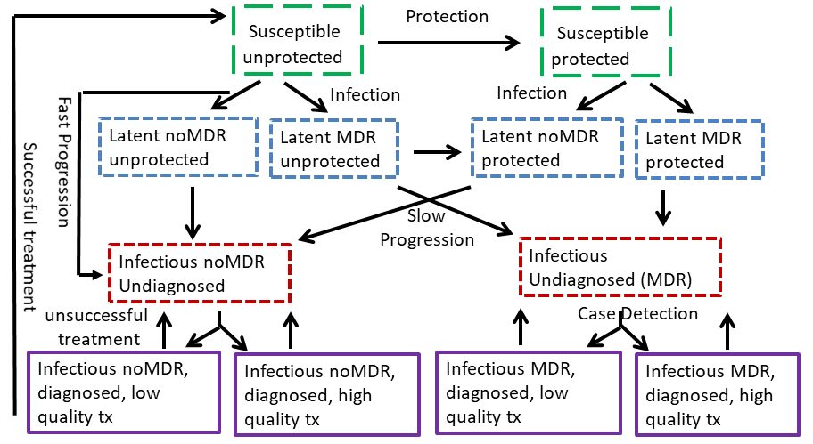
```

---


# Model calibration

```{r tbmaccalibration, echo=FALSE, fig.cap='', out.width = '90%', fig.align='center'}
knitr::include_graphics("./media/tbmaccalibration.jpg")
```

---


# Model predictions

```{r tbmacprediction, echo=FALSE, fig.cap='', out.width = '70%', fig.align='center'}
knitr::include_graphics("./media/tbmacprediction.jpg")
```

---


# Quantitative prediction example
* Trying to predict the 2014 Ebola outbreak.
* Many different groups built models to try and predict the outbreak dynamics and impact of interventions.

---


# Ebola prediction model 1 

```{r cdcebola,  echo=FALSE, out.width="100%", fig.align='center' , fig.cap = 'Meltzer at al 2014 MMWR (https://www.cdc.gov/mmwr/preview/mmwrhtml/su6303a1.htm)'}
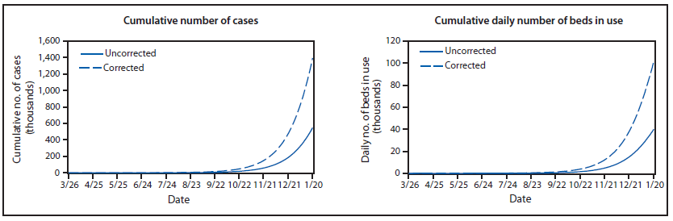
```

"CDC model predicts 1.4 million cases of Ebola by January!"

---

# Ebola prediction model 2 


```{r whoebola,  echo=FALSE, out.width="100%", fig.align='center', fig.cap = 'WHO Ebola Response Team, NEJM 2016 (https://www.nejm.org/doi/full/10.1056/NEJMoa1411100)'}
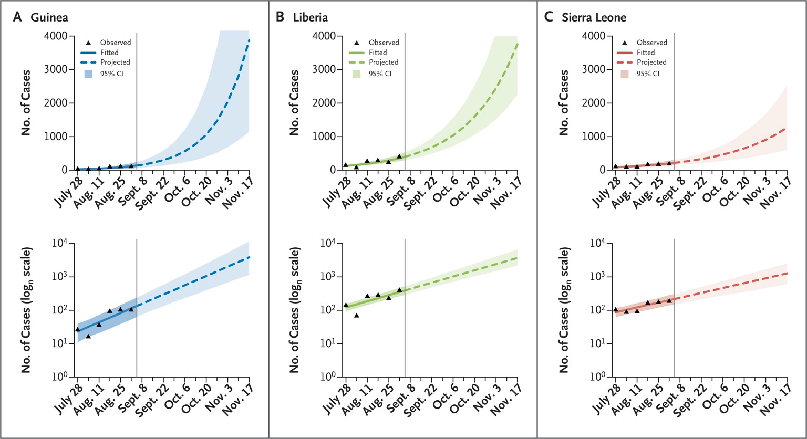
```

---
# Within-host model prediction example
```{r fluexample,  echo=FALSE, out.width="80%", fig.align='center'}
knitr::include_graphics("./media/tbkirschner.png")
```
Prediction of TB infection outcomes for depletion of certain cytokines.  [Wigginton and Kirschner (2001) J Immunology](http://www.jimmunol.org/content/166/3/1951).

---
# Prediction - comments
* Simple models are best for qualitative and semi-quantitative predictions. 
  * If we increase vaccination, does incidence/prevalence drop faster or slower than linear? 
  * As we increase drug dose, how does it affect pathogen load?
* If we want to make precise and detailed predictions, we generally need very detailed (complex) models. 
  * Detailed models are 'data hungry' and often the data are not available.
  * Detailed models are difficult to write and analyze. 


---
# Prediction - comments

.pull-left[
__All models makes simplifying assumptions. Thus, predictions are only reliable if the underlying model is a good approximation of the real system.__
]
.pull-right[
```{r assumption, echo=FALSE, fig.cap='xkcd.com', out.width="90%", fig.align='center'}
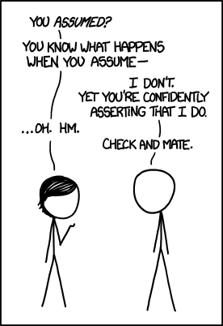
```
]


---
# Prediction - practice
* The _Antiviral treatment_ DSAIRM app allows you to make predictions regarding the impact of drug treatment.
* The _ID Control for multiple outbreaks_ DSAIDE app allows you to explore the example given above in more detail.


---
class: center, middle

# Model fitting

---
# Fitting models to data 

* We build models based on what we assume/know goes on in a specific system.
* We can use models to explore systems and make specific predictions.
* This can be done in the absence of data.
* Adding data to the mix allows us to do more. If we have the right data, we can fit models to it.


```{r experiments,  echo=FALSE, fig.cap='', out.width = '100%', fig.align='center'}
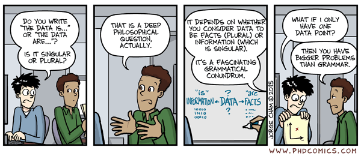
```

---
# Model testing/validation
* At some point, we need to bring our model results in contact with data to see how our model performs.
* Ideally, there is a loop/spiral: 
    1. formulate assumptions/hypotheses 
    2. build and analyze model(s) 
    3. generate hypotheses/make predictions 
    4. compare to data 
    5. repeat  

```{r modelusefig3,  echo=FALSE, fig.cap='', out.width = '50%', fig.align='center'}

```

---
# Model testing/validation
* The same loop happens in all of science, just often without the explicit use of mathematical models: 
    1. have (specify) assumptions about system
    2. generate hypotheses/predictions based on implicit models
    3. do experiment(s)
    4. compare hypotheses/predictions to data 
    5. repeat


---
# Hypothesis testing with non-mechanistic models
* We usually test hypotheses by collecting data and performing statistical tests to see if there is a pattern (H1) or not (H0). 
* The statistical tests can discriminate between no pattern and some kind of pattern/correlation. 
* If data was collected properly, one can often conclude that there is a causal link. But one can't say much about the mechanisms leading to the observed patterns. 

---
# Hypothesis testing with mechanistic models
* With mechanistic simulation models, we can directly __test hypotheses/mechanisms:__ We can formulate different models, each representing a set of hypotheses/mechanisms. The quality of fit of each model to the date lends support to specific models/mechanisms.
* The mechanism(s) of the best fitting model are more likely to be correct than those of the less good fitting models.


---
# Model fitting example 1

* Norovirus can cause infection through a common source (e.g. food), or transmit person-to-person. 

* The Question: For a given Norovirus outbreak, is transmission purely person-person, or is there also a common source? 

* The approach: build models for each hypothesis, fit to data and evaluate.

```{r norocartoon,  fig.cap='',  echo=FALSE, out.width = "70%" , fig.align='center'}

```


---
# Model/Hypothesis 1

Person-person transmission is the only transmission mechanism

```{r SIRdiagram,  fig.cap='',  echo=FALSE, out.width = "80%" , fig.align='center'}

```

$$
\begin{aligned}
\dot S & = -bSI \\
\dot I &  = bSI - gI \\
\dot R &  = gI \\
\end{aligned}
$$


---
# Model/Hypothesis 2

Environmental transmission is __also__ an important transmission mechanism


```{r foodSIRdiagram,  fig.cap='',  echo=FALSE, out.width = "80%" , fig.align='center'}

```

$$
\begin{aligned}
\dot S & = {\bf - nS}  - bSI \\
\dot I &  = {\bf nS} + bSI - gI \\
\dot R &  = gI \\
\end{aligned}
$$


---
# Model fits
* Model with constant source (red, n>0 for duration of outbreak) did not perform better than the no source model (green, n=0).
* Model with extra source between Dec 10-12 (blue, n>0 between 12/10-12/12, 0 otherwise) did best (AIC comparison). 

```{r norofit,  fig.cap='',  echo=FALSE, out.width = "60%" , fig.align='center'}
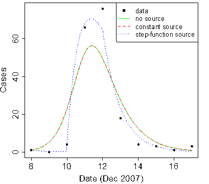
```


---
# Model fitting example 2
* Investigate the mechanism of drug action of neuraminidase inhibitors against influenza.

* The Question: What is the mechanism of action of neuraminidase inhibitors, is it reducing virus production of infected cells or infection of uninfected cells? 

* The approach: build models for each mechanism/hypothesis, fit to data and evaluate.

```{r flushots,  fig.cap='dilbert.com',  echo=FALSE, out.width = "100%" , fig.align='center'}
knitr::include_graphics("./media/dilbert_flushots.gif")
```


---
# Model/Hypothesis 1

Neuraminidase reduces infection rate of uninfected cells.

$$
\begin{aligned}
\dot{U} & =  - b{\bf(1-e)}UV \\
\dot{I} & =  b{\bf(1-e)}UV - d_I I \\     
\dot{V} & =  pI - d_V V -  gb{\bf(1-e)} UV \\
\end{aligned}
$$

---
# Model/Hypothesis 2

Neuraminidase reduces rate of virus production by infected cells.

$$
\begin{aligned}
\dot{U} & =  - bUV \\
\dot{I} & =  bUV - d_I I \\     
\dot{V} & =  p{\bf (1-f)}I - d_V V -  gb UV \\
\end{aligned}
$$


---
# Model fits
Solid lines show best fits of model with mechanism 1, dashed lines show model with mechanism 2. Statistical comparison suggests model/mechanism 2 explains the data better (AICc1=-56 and AICc2=-82).

```{r flufit,  fig.cap='',  echo=FALSE, out.width = "60%" , fig.align='center'}
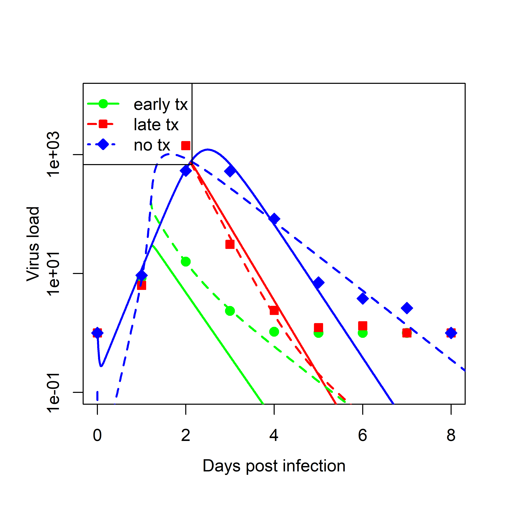
```


---
# Parameter estimates
* By fitting models, we can also __estimate biologically meaningful parameters.__ 
* The parameters in our models often represent important biological quantities (e.g. the duration of the infectious period). 
* Fitting returns estimates for the best-fit parameter values.
* If we believe the model is a decent representation of the real system, we might consider the estimated parameter to be reliable.

.pull-left[
In example 1, an estimate of g=0.5/day means the estimated duration of the infectious period is 2 days.

$$
\begin{aligned}
\dot S & =  - nS  - bSI \\
\dot I &  =  nS + bSI -{\bf g}I \\
\dot R &  = {\bf g}I \\
\end{aligned}
$$
]
.pull-right[
In example 2, an estimate of f=0.98 means the drug reduces virus production by 98%.

$$
\begin{aligned}
\dot{U} & =  - bUV \\
\dot{I} & =  bUV - d_I I \\     
\dot{V} & =  p{\bf (1-f)}I - d_V V -  gb UV \\
\end{aligned}
$$
]
---
# Fitting comments
.pull-left[
* Fitting mechanistic models is conceptually the same as fitting regression models, but technically more challenging.
* If a non-mechanistic model doesn't fit well, we only learned that we need another model.
* If a mechanistic model that was built based on our best knowledge doesn't fit well, we have learned something useful!
* Complex models with many parameters can provide good fits for spurious reasons. 
* It is important to keep models simple to prevent overfitting.
]

.pull-right[
_With four parameters I can fit an elephant, and with five I can make him wiggle his trunk._

John von Neumann

```{r elephant,  fig.cap='https://bit.ly/31UB3v9',  echo=FALSE, out.width = "100%" , fig.align='center'}
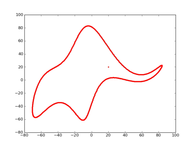
```
]


---
# Fitting - practice
* The _Basic Model fitting_ app in DSAIRM provides an introduction, the other apps in the _Model fitting_ section teach further concepts.
* The apps in the _Model fitting_ section of DSAIDE teach some concepts of model fitting.

---
# Model uses - summary
* Simulation models can be built and analyzed without fitting to data.
* 'Data-free' model use allows exploration and potentially prediction.
* Hypothesis/mechanism testing and parameter estimation are possibe if models are combined with data.
* A project often uses models for several of the described approaches.

```{r modelusefig2,  echo=FALSE, fig.cap='', out.width = '70%', fig.align='center'}

```

---
# Literature 
* Joshua Epstein, "Why model", http://jasss.soc.surrey.ac.uk/11/4/12.html
* Rob May, "Uses and Abuses of Mathematics in Biology", doi:10.1126/science.1094442
* Fred Brauer, "Mathematical epidemiology is not an oxymoron", doi:10.1186/1471-2458-9-S1-S2
* Garnett et al, "Mathematical models in the evaluation of health programmes", doi:10.1016/S0140-6736(10)61505-X 


